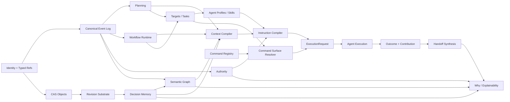

# Dependency map — product concepts and implementation order

## Canonical dependency chain

## Feature dependency rules

- Decision Memory MUST reuse Revision/CAS primitives.
- `why` MUST query SemanticGraph + typed source resolvers, never arbitrary stores.
- Context Compiler consumes references/projections and owns no duplicate durable knowledge.
- Instruction Compiler consumes typed sources and must not scrape arbitrary Markdown ad hoc at execution time.
- AgentCommandSurface derives from CommandRegistry + Target/Task + profile relevance; it is not handwritten.
- Synthesis receipts preserve Contribution/Evidence refs and dispositions rather than copy/mutate source material.
- Targets/Tasks use governed capabilities for side effects.
- Packs register through extension contracts; they cannot write projection tables or bypass Authority.
- Provider adapters know provider APIs and rendering only; they do not implement SDDK policy or workflow semantics.
- Human help, completions, JSON command schema and agent cheat sheets derive from one command definition substrate.

## Existing evolution items crosswalk

| Existing item | New disposition |
|---|---|
| CDD-HANDOFF-002 | M5: retain substrate, stabilize under Outcome/Contribution/Synthesis + dissent preservation |
| CDD-MEMORY-001 | M4: implement after common Revision substrate |
| CDD-MEMORY-002 | M4: Memory porcelain over shared revision/query primitives |
| GRAPH-WHY-001 | M3: typed views over SemanticGraph; no separate ActiveGraph authority |
| GRAPH-WHY-002 | M8: ExplanationProof queries over SemanticGraph + Memory + Authority provenance |
| prompts/agents/skills/templates evolution | M7: explicit Agent Experience migration; no implicit post-refactor cleanup |

## Removal ordering constraint

A legacy model or agent asset is removed only after replacement contract, compatibility path where needed, parity fixture, migration/rebuild validation, and an explicit deprecation/removal decision.
