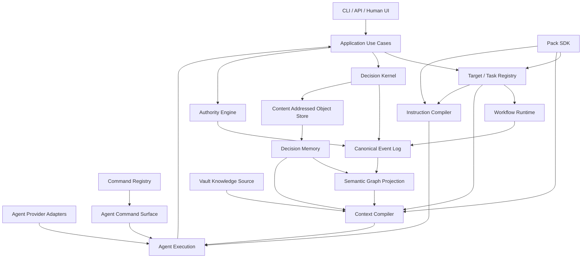

# Target architecture

## Logical architecture



## Dependency direction

Production dependency direction MUST be inward:

```text
adapters / cli / gateway / storage / provider adapters
                         ↓
                    application
                         ↓
                       domain
```

Packs may depend on public kernel/pack SDK contracts, never CLI internals, concrete SQLite adapters or provider-specific SDKs.

## Kernel owns

- stable identity and typed references;
- canonical fact/event schemas;
- universal Evidence and provenance primitives;
- Decision and Authority primitives;
- Revision primitives;
- workflow plan/run contracts;
- Target/Task contracts;
- Pack extension contracts;
- invariant validation.

## Agent Experience layer owns

- `AgentProfile` provider-independent role contracts;
- `SkillDefinition` procedural contracts;
- typed instruction sources and deterministic `InstructionCompiler`;
- `CommandRegistry` contract export;
- contextual `AgentCommandSurface`/cheat sheet derivation;
- provider adapter translation;
- execution provenance hashes for context/instructions/commands/skills/tools/model descriptor.

It does **not** own business decisions, capability authorization, Decision Memory or runtime state.

## Storage topology

```text
CanonicalEventLog          immutable CAS
       │                       │
       ├────► projections       ├────► artifacts/evidence bodies
       ├────► run state         └────► revisions/memory objects
       ├────► semantic graph
       └────► observability facts where canonical
```

Only facts and immutable objects are durable authorities. A projection store may be deleted and rebuilt.

## Knowledge topology

```text
Code / docs / Vault / project rules / Memory / Evidence
                        │
                        ▼
                  Context Compiler
                        │
                 ContextCapsule
```

Project instructions and Agent/Skill instructions are **procedural inputs**, not Decision Memory. The Context Compiler selects what the agent should know about the problem; the Instruction Compiler defines how the agent should operate.

## Agent execution topology

```text
Target/Task ───────────────┐
AgentProfile ──────────────┤
Project rules ─────────────┤
SkillDefinitions ──────────┤
Policy constraints ────────┤──► InstructionCompiler ─► EffectiveInstructions
ContextCapsule ────────────┤
CommandRegistry ─► Resolver┘                         └► AgentCommandSurface
                                                       │
                                                       ▼
                                                ExecutionRequest
                                                       │
                                                       ▼
                                                 ProviderAdapter
                                                       │
                                                       ▼
                                                     Model
                                                       │
                                          Outcome + Contribution
```

## Critical separation: command visibility vs authority

`AgentCommandSurface` answers **“what commands are relevant and how are they called?”**.

`AuthorityEngine` answers **“may this effect occur now, for this actor, with this evidence and policy?”**.

No provider adapter or prompt fragment can bypass the second question.
