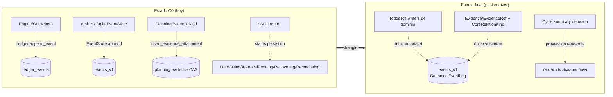

# DESIGN-C1-C3-CUTOVERS — Events, Evidence y Cycle/Run cutover

> Ciclo: `p-63676b11dc0ef88f/conformance-closeout-2026-09-13` (fase design).
> Implementa los delta specs:
> - [DELTA-CONF-002 — Canonical Event Log Cutover](../specs/delta/DELTA-CONF-002-events-cutover.md) (C1)
> - [DELTA-CONF-003 — Universal Evidence Cutover](../specs/delta/DELTA-CONF-003-evidence-cutover.md) (C2)
> - [DELTA-CONF-004 — Cycle / Run Lifecycle Cutover](../specs/delta/DELTA-CONF-004-cycle-run-cutover.md) (C3)
>
> Contrato marco: [SPEC-CONF-001 §Compatibility exception](../specs/SPEC-CONF-001-BASELINE-CONFORMANCE-CONTRACT.md:59-68)
> (6 condiciones). Checklist de migración: [MIGRATION-CUTOVER-CHECKLIST.md](../reference/MIGRATION-CUTOVER-CHECKLIST.md).
>
> Fecha de medición del inventario: 2026-09-13, HEAD de `main`.
> Restricción de diseño: **no se propone API nueva** más allá de lo mínimo para
> el cutover. Se reutilizan los ports existentes `CanonicalEventLog`
> (`crates/sddk-engine/src/canonical_event_log.rs:222`), `EventStore`
> (`crates/sddk-domain/src/ports.rs:312`), `CoreRelationKind`
> (`crates/sddk-engine/src/evidence_relation_mapping.rs`) y `WorkflowRun`
> (`crates/sddk-domain/src/workflow_run.rs:387`).

---

## 0. Resumen de arquitectura objetivo

Principios comunes a los tres cutovers:

1. **Strangler, no flag-day**: redirect → hard-disable → read-only window → removal.
2. **Una autoridad por concepto** (AGENTS.md §2.7): `events_v1` para eventos de
   dominio, `Evidence/EvidenceRef` para evidencia, Run/Authority facts para
   estados runtime.
3. **Read-compat solo bajo las 6 condiciones** de SPEC-CONF-001 (sin writes
   canónicos, borrable, deriva del canónico, parity test, owner+trigger,
   fitness anti-nuevas-dependencias).
4. **Ratchets promoted a blocking solo con mutation test en CI**
   (`CONFORMANCE-FITNESS-RATCHETS.md:46-60`).

---

## 1. C1 — Canonical Event Log Cutover (DELTA-CONF-002)

### 1.1 Inventario de call sites (estado medido 2026-09-13)

La escritura a `ledger_events` está centralizada en UNA función privada y
CUATRO wrappers públicos de `Storage`. Todo el resto del árbol pasa por ahí.

**Writers (cadena de escritura):**

| # | Call site | Rol | Naturaleza |
|---|---|---|---|
| W0 | `crates/sddk-storage/src/lib.rs:1569` — `fn append_event_on(&Transaction, &LedgerEventInput)` | Único `INSERT INTO ledger_events` (lib.rs:1582). Computa `sequence` global + hash-chain | Núcleo legacy |
| W1 | `crates/sddk-storage/src/lib.rs:531` — `Storage::insert_cycle_with_event` | Inserta ciclo + evento inicial atómico | Producción |
| W2 | `crates/sddk-storage/src/lib.rs:567` — `Storage::update_cycle_with_event(manifest, updated_at, event, release_lease_on_phase_change)` | UPDATE ciclo + evento causal; emite `lease.released` secundario (lib.rs:628) | Producción |
| W3 | `crates/sddk-storage/src/lib.rs:636` — `Storage::append_event` | Append genérico (lease release en lib.rs:1300 vía `release_cycle_lease`) | Producción |
| W4 | `crates/sddk-storage/src/lib.rs:1300` — evento `lease.released` dentro de `release_cycle_lease` | Evento de auditoría de lease | Producción |
| — | `crates/sddk-engine/src/lib.rs:1274,1336,1409` — `Engine::{create_cycle, apply_transition, rebuild_cycle}` | Consumen W1/W2 vía trait `Ledger` (`crates/sddk-domain/src/ports.rs:155` y ss.) | Producción |
| — | `crates/sddk-engine/src/cycle_pause.rs:215,221,384,399,405`, `cycle_replan.rs:214,225`, `cycle_supersede.rs:234,240` | Consumen W2 | Producción |
| — | `crates/sddk-cli/src/cycle.rs:2790` y ss. | Todos los `insert_cycle_with_event` del CLI están en `mod tests` (línea 2724+) | Solo test |

**La autoridad canónica paralela (destino del redirect):**

| Elemento | Localización |
|---|---|
| Port `CanonicalEventLog` (CA-001/CA-006) | `crates/sddk-engine/src/canonical_event_log.rs:222` |
| `SqliteEventStore` → tabla `events_v1` | `crates/sddk-storage/src/event_store.rs:170` (`fn append`) |
| Emisores de eventos de dominio (`emit_*`, protocolo común) | `crates/sddk-engine/src/event_bus/emit.rs:225-1129` (`emit_phase_event`, `emit_approval_requested:304`, `emit_approval_decision:384`, `emit_workflow_run_started:506`, …) |
| Consumidores CLI del camino canónico | `crates/sddk-cli/src/approval.rs` (usa `event_store` vía `emit_approval_decision`) |

**Lectores de `ledger_events` (no writers — se quedan durante la ventana):**

| Lector | Localización | Disposición |
|---|---|---|
| Proyección de grafo | `crates/sddk-storage/src/graph_store.rs:131` (`load_all_ledger_events`) | Deriva a decoder read-only; el grafo reconstruye desde `events_v1` |
| Fork/telemetry/watch | `crates/sddk-cli/src/fork_cmd.rs:158,323`, `crates/sddk-cli/src/telemetry.rs:507` (trait `Ledger::load_all_ledger_events`, ports.rs:155) | Decoder read-only con allowlist |
| Authority engine (metadatos de superficie) | `crates/sddk-engine/src/authority.rs:42`, `authority_engine/bridge.rs:27,191,214`, `runner.rs:221` | Solo nombres de superficie, no writes |
| Migration/export | `crates/sddk-storage/src/spine_import.rs`, `migrations.rs:297-330` (triggers `ledger_events_no_update/no_delete`) | Read-only + export fixture |

**Conclusión del inventario:** el redirect es factible en un punto de
estrangulamiento único: los wrappers W1–W4 de `Storage`. No hay writers
dispersos.

### 1.2 Estrategia strangler por call site

Orden seguro (cada paso mantiene verdes los tests de contención de
DELTA-CONF-002 §3):

| Paso | Acción | Call sites | Test de contención que protege el paso |
|---|---|---|---|
| **C1.1** | **Export/recovery fixture** (gate destructivo del checklist): test que exporta `ledger_events` a fixture con counts+digest, demuestra re-import idempotente y rollback determinista. No toca writers. | — | `cross_ledger_consistency` suite (`crates/sddk-storage/tests/cross_ledger_consistency.rs:130,173,198,238`) |
| **C1.2** | **Redirect**: los eventos de dominio que hoy emiten W1–W4 como `cycle.transitioned`, `lease.released`, `cycle.created`, etc., pasan a emitirse vía `EventStore`/`emit_*` sobre `events_v1` (reusar `emit.rs` + `FactEnvelopeV1`). Los wrappers W1–W4 quedan **solo** para el snapshot materializado del ciclo (tabla `cycles`), con su evento causal ya emitido por el camino canónico. | W1–W4, `Engine::{create_cycle, apply_transition, rebuild_cycle}`, `cycle_pause/replan/supersede` | `pe01_dual_emit_sequence_and_payload` (`phase_events_integration.rs:49`); `event_envelope_golden` / `event_replay_equality`; `cli_walks_cycle_with_fencing_and_rebuilds_state` (`cli.rs:1109`) |
| **C1.3** | **Hard-disable del write legacy**: `append_event_on` (lib.rs:1569) pasa a `unreachable`/error tipado `event_store:<code>` si se alcanza con `event_type` de dominio; los 4 wrappers se marcan `#[deprecated]` y su única función restante es escribir el snapshot de `cycles` **sin** evento (o devolver el receipt del evento canónico ya emitido). `WritableSurface::LedgerEvents` (`crates/sddk-engine/src/authority.rs:42`) pasa a deny en `AuthorityContext::validate`. | W0–W4 | `pe04_ledger_coexistence_events_v1_only` (`phase_events_integration.rs:153`) + su sucesor que documenta el nuevo boundary; tests de lease (`cli_walks_cycle_with_fencing_and_rebuilds_state`) |
| **C1.4** | **Read-only window**: `ledger_events` queda legible solo vía decoder/migración idempotente (lectores del inventario §1.1). Entrada de allowlist con los 8 campos de `CONFORMANCE-FITNESS-RATCHETS.md:29-40`, `read_or_write = read`, parity test nombrado. | Lectores: `graph_store.rs:131`, `fork_cmd.rs:158,323`, `telemetry.rs:507` | `verify_cross_ledger_consistency_passes_when_aligned` + parity fixture legacy↔canónico |
| **C1.5** | **Removal** (tras ventana, con removal trigger registrado en allowlist): borrar tabla + wrappers muertos. Gate destructivo: solo tras C1.1 export + rebuild canónico probado + dry-run con counts/digests. | W0–W4, `migrations.rs:297-330` | Fresh-repo + migrated-repo fixtures idénticos (R-002.2); `rebuild_happy_path` (`cli_projection_rebuild.rs:86`) |

Nota sobre no-cross-table-atomicity: tras C1.2, el par (snapshot `cycles`,
evento `events_v1`) NO comparte transacción (hoy tampoco la hay entre
`ledger_events` y `events_v1`, `event_store.rs:25`). El estado final no
introduce cross-table atomicity; el snapshot es proyección reconstruible desde
`events_v1` (replay), lo que hace la inconsistencia transitoria auto-reparable
vía `Engine::rebuild_cycle` (`crates/sddk-engine/src/lib.rs:1365`).

### 1.3 Nuevos tests C1

| Test (nombre) | Ubicación | Escenario delta cubierto |
|---|---|---|
| `legacy_ledger_export_reimport_is_idempotent_and_restart_safe` | `crates/sddk-storage/tests/legacy_ledger_migration.rs` (nuevo) | §2.4: migración dry-runnable, restart-safe, idempotente bajo failure injection |
| `domain_event_append_goes_only_through_canonical_log` | `crates/sddk-engine/tests/phase_events_integration.rs` (añadir) | R-002.1 (pre-mutation): tras redirect, append de dominio solo toca `events_v1` |
| `second_event_store_authority_is_rejected_mutation` | `crates/sddk-cli/tests/arch_ratchet_mutations.rs` (nuevo) | **R-002.1 mutation test**: fixture inyecta un segundo `EventStore` alcanzable en producción → ratchet falla nombrando los dos owners; árbol limpio pasa. Se apoya en el marker `canonical_event_log_owner_recognised` (`crates/sddk-cli/src/dev/arch_lint.rs:778`) |
| `fresh_and_migrated_repo_read_canonical_stream_identically` | `crates/sddk-storage/tests/canonical_parity.rs` (nuevo) | R-002.2: mismos fact_ids, orden y estado de proyección en repo limpio vs migrado |
| `delete_projections_rebuild_from_canonical_stream_only` | `crates/sddk-cli/tests/cli_projection_rebuild.rs` (añadir a `rebuild_happy_path` con assertion de no-lectura legacy) | R-002.3 |
| `legacy_domain_write_is_rejected_with_typed_error` | `crates/sddk-storage/tests/cross_ledger_consistency.rs` (añadir) | R-002.4 / CLOSE-01: append de dominio vía camino legacy → error tipado `event_store:<code>` |
| `legacy_reads_only_via_readonly_decoder_allowlist` | `crates/sddk-cli/tests/arch_ratchet_mutations.rs` | R-002.5: test de dependencia estática; ningún módulo fuera del allowlist referencia la escritura legacy |
| `explanation_event_ids_stable_across_cutover` | `crates/sddk-cli/tests/cli_graph_e2e.rs` (junto a `graph_rebuild_then_query_then_why:143`) | R-002.6: ids/orden estables o receipt de mapping `old_id -> new_id` versionado en artefactos del ciclo |

Los 6 cubren los ratchets `conf09_one_event_append_authority` (R-002.1–.3) y
`conf09_no_legacy_event_writes` (R-002.4–.6), que quedan promoted a blocking
cuando sus mutation tests estén en CI.

---

## 2. C2 — Universal Evidence Cutover (DELTA-CONF-003)

### 2.1 Inventario de call sites (estado medido 2026-09-13)

**Constructores de `PlanningEvidenceKind` fuera del mapping module
(`evidence_relation_mapping.rs`):**

| # | Call site | Rol | Naturaleza |
|---|---|---|---|
| E1 | `crates/sddk-cli/src/plan.rs:868-872` — `run_evidence`: parse `"log"/"metric"/"snapshot"/"reference"/"approval"` → `PlanningEvidenceKind::*` (líneas 868, 869, 870, 871, 872) | **Único writer de producción** de evidencia planning nueva (CLI `plan evidence attach`) → `EvidenceAttachmentRecord` (plan.rs:882) → `storage.insert_evidence_attachment` (lib.rs:2557) | Writer producción |
| E2 | `crates/sddk-domain/src/planning/mod.rs:285-319` — definición del enum; `:337-362` `EvidenceAttachmentV1::new(kind, …)`; `:1091-1109` `EvidenceAttachmentRecord.kind` | Definición + constructor de dominio | Definición legacy |
| E3 | `crates/sddk-domain/src/lib.rs:94` — re-export público de `PlanningEvidenceKind` | Superficie pública | Re-export |
| E4 | `crates/sddk-storage/src/spine_import.rs:382` — construye `EvidenceAttachmentRecord` al importar | **Decoder/migración** legítimo (read-import de repos legacy) | Compat permitida |
| — | `crates/sddk-domain/tests/planning_provenance.rs:144,296,306,440,542,552,636,664,736`; `crates/sddk-domain/src/planning/mod.rs:1354-1365,1404-1423` (tests inline) | Fixtures de tests | No producción |

**Mapping ya existente (no tocar):** `planning_evidence_relation`
(`crates/sddk-engine/src/evidence_relation_mapping.rs:46`), total y pinneado
por `assert_planning_evidence_kind_mapping_total` (:133) y
`mapping_collapses_to_four_relations` (5→4, Log/Snapshot → `ObservedFor`).
Mapping: `Log → ObservedFor`, `Metric → Verifies`, `Snapshot → ObservedFor`,
`Reference → References`, `Approval → Justifies` (:48-52).

**Substrate universal destino (ya existe):** `EvidenceRef`/`EvidenceKind`
(`crates/sddk-engine/src/evidence_ref.rs:18-59`, con
`From<EvidenceAttachmentV1> for EvidenceRef` en :181) y `CoreRelationKind`
con las 5 relaciones (`supports`, `verifies`, `gates`, `produced_by`,
`contradicts`).

**Lint existente:** `evidence_kind_v1` advisory con 57 hits
(`docs/architecture/lints/deprecated_patterns.toml:26,72`; enforcement en
`crates/sddk-cli/src/dev/lint/deprecated_patterns.rs:305`). El ratchet
monotónico (R-003.5) ya tiene anclaje en `deprecated_patterns.toml:276`.

### 2.2 Estrategia strangler por call site

| Paso | Acción | Call sites | Test de contención |
|---|---|---|---|
| **C2.1** | **Redirect E1** (el único writer de producción): `run_evidence` (`plan.rs:836-924`) construye `EvidenceRef` (`EvidenceKind::Planning` + locator/CAS, reusando `EvidenceRef::new/with_cas`, evidence_ref.rs:53-66) + relación semántica vía `planning_evidence_relation` + `CoreRelationKind`. El flag `--kind` del CLI conserva su UI (log/metric/…) pero resuelve a la relación universal en vez de al enum legacy. Actualiza `deprecated_patterns.toml` (57 → N hits) en el mismo commit. | E1 | `assert_planning_evidence_kind_mapping_total` (evidence_relation_mapping.rs:133); `passed_with_all_three_fields_is_accepted` (`gate_receipt_pass_evidence.rs:24`); `clap_surface_and_command_specs_are_in_sync` (`command_spec_tests.rs:187`), `cli_golden` (`cli_golden.rs:71`) si cambia ayuda/flags |
| **C2.2** | **Allowlist E4 como read-compat**: `spine_import.rs:382` queda como único constructor permitido (decoder de import). Entra al allowlist con los 8 campos (owner, removal trigger = fin de ventana, parity test = `fresh_and_migrated` de C2.3). | E4 | `spine_import_idempotent` (`crates/sddk-storage/tests/spine_import_idempotent.rs`); `planning_migration_15` |
| **C2.3** | **Migración de datos persistidos**: migración idempotente `EvidenceAttachmentV1` → `EvidenceRef` + relación (usa el `From` existente, evidence_ref.rs:181), preservando bytes/source refs en CAS (C0: ya está el body en CAS con hash). Dry-run con counts/digests (checklist §Destructive removal gate). | Datos en `planning evidence CAS` + tablas de attachments | Fixture de parity: outputs planning/WHY equivalentes pre/post (R-003.3); `planning_cross_storage` (`crates/sddk-domain/tests/planning_cross_storage.rs`) |
| **C2.4** | **Promote lint advisory → deny** (`evidence_kind_v1`): con E1 redirigido y E4 en allowlist, los hits residuales son solo tests/definición. El lint deny falla build sobre cualquier constructor nuevo en producción. `assert_variant_count_eq!` de `evidence_kind_is_five_variants` (planning/mod.rs:1354) se actualiza en el mismo commit que cualquier cambio del enum, con receipt. | E2, E3 | `live_registry_asset_lints_are_promoted_or_advisory_and_clean` (`crates/sddk-cli/src/dev/lint/deprecated_patterns.rs`); suite `sp04`-equivalente: `evidence_kind_is_five_variants` |
| **C2.5** | **Removal / cierre de evidence-migration-v2** (R-003.6): o bien 0 hits y el enum se reduce a decoder-only (o se elimina tras ventana), o prueba formal ejecutable de inalcanzabilidad (scan + test de dependencia citados en receipt). Entrada UNBLOCK de `deprecated_patterns.toml:294` resuelta con receipt. | E2, E3 | `evidence_kind_is_five_variants` (actualizado con receipt), scans del ratchet |

### 2.3 Nuevos tests C2

| Test (nombre) | Ubicación | Escenario delta |
|---|---|---|
| `planning_evidence_attach_writes_universal_evidence_ref` | `crates/sddk-cli/tests/plan_evidence_tests.rs` (nuevo) | R-003.2/R-003.5: el attach de evidencia persiste `EvidenceRef` + relación semántica, no `PlanningEvidenceKind` |
| `universal_evidence_only_second_hierarchy_rejected_mutation` | `crates/sddk-cli/tests/arch_ratchet_mutations.rs` | **R-003.1 mutation test** (ratchet `conf09_universal_evidence_only`): inyecta re-export/raíz paralela de evidencia en módulo de producción → falla nombrando símbolo y módulo |
| `planning_evidence_new_write_in_production_fails_mutation` | `crates/sddk-cli/tests/arch_ratchet_mutations.rs` | **R-003.4 mutation test** (ratchet `conf09_no_planning_evidence_new_writes`, CLOSE-02): inyecta `PlanningEvidenceKind` constructor en módulo de producción → lint deny falla nombrando call-site; allowlist solo decoders |
| `migrated_evidence_outputs_are_equivalent` | `crates/sddk-storage/tests/evidence_migration_parity.rs` (nuevo) | R-003.3: planning/WHY pre y post migración equivalentes; UAT-04/05/11/19 green |
| `evidence_kind_v1_hits_are_monotonically_non_increasing` | `crates/sddk-cli/src/dev/lint/deprecated_patterns.rs` (test junto al registry) | R-003.5: contador auditado en `deprecated_patterns.toml:276` no crece entre releases |
| `evidence_migration_v2_debt_is_closed` | `crates/sddk-cli/tests/arch_ratchet_mutations.rs` | R-003.6: 0 hits o prueba de inalcanzabilidad citable en receipt |

Ratchets `conf09_universal_evidence_only` y `conf09_no_planning_evidence_new_writes`
quedan blocking cuando los dos mutation tests estén en CI (regla
`CONFORMANCE-FITNESS-RATCHETS.md:60`).

---

## 3. C3 — Cycle / Run Lifecycle Cutover (DELTA-CONF-004)

### 3.1 Inventario de call sites (estado medido 2026-09-13)

**Puntos de escritura de `UatWaiting`/`ApprovalPending`/`Recovering`/`Remediating`:**

| # | Call site | Rol | Naturaleza |
|---|---|---|---|
| S1 | `crates/sddk-storage/src/migrations.rs:275-282` — CHECK constraint de `cycles.status`: acepta `'REMEDIATING'` y `'RECOVERING'` (nota: `'UAT_WAITING'`/`'APPROVAL_PENDING'` **no** están en el CHECK; solo en `manifest_json`) | Persistencia física del status | Schema |
| S2 | `crates/sddk-domain/src/cycle.rs:21,31,33,35` — definición de las 4 variantes; `:46-53` partición DERIVED del enum | Definición | Dominio |
| S3 | `crates/sddk-engine/src/lib.rs:1301-1345` — `apply_transition`: persiste `plan.state_after.status` (el que venga del manifest del workflow) vía `update_cycle_with_event` (lib.rs:1336) | **Puerta única de persistencia de status** en producción | Writer |
| S4 | `crates/sddk-engine/src/cycle_pause.rs:111-114` — match de validación de pause que **lee** las 4 variantes (`Remediating:111`, `UatWaiting:112`, `ApprovalPending:113`, `Recovering:114`); `:215-405` persiste `Paused`/restore | Lectura/guard de variantes runtime | Reader |
| S5 | `crates/sddk-domain/src/workflow.rs:445` — manifest de test con `Remediating` en `statuses` (cfg(test)); `crates/sddk-domain/tests/workflow_yaml.rs:35,60,159`; `crates/sddk-engine/tests/workflow_engine.rs:326,332` | Fixtures FSM que declaran los estados como alcanzables | Tests |
| S6 | `crates/sddk-domain/src/cycle.rs:580-584` — `test_cycle_status_approval_pending_roundtrip` (wire-compat de deserialización) | Test de contención a preservar como decode-only | Test |
| — | `crates/sddk-domain/tests/sp04_cycle_status_slimming.rs:37-44,67-70,147-159` — matriz DELIVERY/DERIVED y targets de migración | Documentación executable | Test |
| — | CLI: `crates/sddk-cli/src/release_cmd.rs:925,1324,1524` solo consulta `ReleasePending`/`Blocked` (no variantes runtime); `crates/sddk-cli/src/cycle.rs` no construye variantes runtime fuera de tests | — | — |

**Hechos del Run/Authority destino (ya existen):** `WorkflowRun` +
`WorkflowRunState` (`crates/sddk-domain/src/workflow_run.rs:387,359` con
`pending/running/paused/completed/failed/cancelled`), proyecciones
`workflow_runs_v1`/`node_runs_v1`/`attempts_v1`
(`crates/sddk-storage/src/migrations.rs:582-641`, **projection tables** con
source-of-truth en `events_v1`), eventos de aprobación
`emit_approval_requested`/`emit_approval_decision`
(`crates/sddk-engine/src/event_bus/emit.rs:304,384`) ya sobre el EventStore
canónico, gate receipts con evidencia
(`gate_receipt_pass_evidence.rs:24`), y `sddk approval list|grant|deny`
(`crates/sddk-cli/src/approval.rs`).

**Hallazgo clave:** en producción **no existe ninguna línea que construya
`CycleStatus::UatWaiting/ApprovalPending/Recovering` para persistirla**; la
persistencia ocurre genéricamente por S3 cuando el `WorkflowManifest`
de la FSM las declara en `statuses` (los fixtures S5 lo demuestran) o cuando
datos históricos las traen. El cutover es por tanto principalmente de
**validación + derivación + guard**, no de reescritura de writers.

### 3.2 Estrategia strangler por call site

| Paso | Acción | Call sites | Test de contención |
|---|---|---|---|
| **C3.1** | **Derived summary (redirect de lectura)**: nuevo módulo de proyección (read-only) `cycle_summary` que deriva el estado de espera/recuperación desde Run/Authority facts: approval-waiting desde `ApprovalProjection` + eventos `approval.requested/decision`; UAT-wait desde gate receipts pendientes; recovery desde `WorkflowRunState::Failed` + retry/retry facts de `attempts_v1`. `run_cycle_status` renderiza el derived summary junto al status persistido (aún delivery-level). | CLI status rendering (`crates/sddk-cli/src/cycle.rs:1236`, `cycle_status_text:2418`) | `cli_golden` (re-bless con receipt), `cli_walks_cycle_with_fencing_and_rebuilds_state` (`cli.rs:1109`) |
| **C3.2** | **Stop new writes**: `Engine::apply_transition` (S3) valida en `plan_transition_from_state` que `state_after.status ∈ DELIVERY_VARIANTS` (`Open, Paused, ReleasePending, Released, Closed, Abandoned`, matriz sp04); una transición cuyo target sea variante DERIVED pasa a emitir el hecho en Run/Authority/gate (los emisores ya existen: `emit_approval_requested/decision`, gate receipts) y el status del Cycle permanece en el último delivery-level. También se elimina `Remediating`/`Recovering` de los manifests FSM declarados (S5 se actualiza; `Remediating` solo sobrevive con ADR dedicada — matriz sp04 lo marca REVIEW). | S3, S5 | `sp04_cycle_status_slimming` suite (`:74,:137` — actualizada en el mismo commit con receipt); `workflow_engine.rs:326` se sustituye por su sucesor citado en receipt; `workflow_run_pause_resume_preserves_budget` (`workflow_run_smoke.rs:135`), `workflow_run_lifecycle_events` |
| **C3.3** | **Guard de escritura (hard-disable)**: (a) compile-time — las 4 variantes pasan a `#[doc(hidden)]` + constructor no exportado desde `sddk_domain` (E3-style: retirar del re-export raíz); (b) runtime — `update_cycle_with_event` / `enum_string` falla con error tipado si `status` serializa a variante DERIVED; (c) schema — migración nueva estrecha el CHECK de `cycles.status` (S1) quitando `'REMEDIATING'`/`'RECOVERING'` para **nuevas filas** (tabla nueva `cycles_v2` o check migration con backfill a delivery-level). | S1, S2, S3 | `test_cycle_status_approval_pending_roundtrip` (cycle.rs:580) pasa como **decode-only**; `delivery_variants_serialize_roundtrip`; suite `cross_ledger_consistency` |
| **C3.4** | **Read-only window / decode-only**: repos históricos con `'UAT_WAITING'`/`'APPROVAL_PENDING'` en `manifest_json` (fuera del CHECK) y `'REMEDIATING'`/`'RECOVERING'` en columna: deserialización sigue funcionando (S6), el rendering deriva labels de compatibilidad desde Run facts vía el mapping de C3.1 (decode-only). Entrada de allowlist con 6 condiciones SPEC-CONF-001 (parity test = fixture de C3.5; owner + removal trigger registrados). | Lectores de manifest, vistas legacy | `sp04_cycle_status_slimming` (parte DELIVERY intacta); parity fixture |
| **C3.5** | **Removal** (tras ventana): DROP de variantes del enum (rompe compile en cualquier dependiente vivo — fitness por diseño), CHECK final sin estados runtime, matriz sp04 actualizada (DERIVED=0 o solo las que tengan ADR). | S1, S2 | Fresh + migrated fixtures; UAT-03 green |

### 3.3 Nuevos tests C3

| Test (nombre) | Ubicación | Escenario delta |
|---|---|---|
| `cycle_summary_derived_from_run_and_authority_facts` | `crates/sddk-cli/tests/cycle_derived_summary.rs` (nuevo) | R-004.2 (approval) y §2.3: summary derivado sin estado runtime persistido |
| `multi_run_heterogeneous_cycle_has_consistent_derived_summary` | `crates/sddk-engine/tests/cycle_multi_run_summary.rs` (nuevo) | **R-004.5 / UAT-03**: Run A failed + Run B approval-waiting + Run C passed → summary determinista, sin contradicción, re-derivable |
| `uat_wait_and_result_are_run_gate_facts` | `crates/sddk-engine/tests/cycle_multi_run_summary.rs` | R-004.3: espera/resultado UAT como gate/evidence facts; `passed_with_all_three_fields_is_accepted` verde |
| `retry_recovery_is_run_execution_fact` | `crates/sddk-domain/tests/workflow_run_recovery_fact.rs` (nuevo) | R-004.4: recovery/retry toca Run (`WorkflowRunState`), nunca el status del Cycle |
| `derived_runtime_status_write_is_rejected_mutation` | `crates/sddk-cli/tests/arch_ratchet_mutations.rs` | **R-004.1 mutation test** (ratchet `conf09_no_runtime_cycle_truth`, CLOSE-03): inyecta transición que persiste `CycleStatus::ApprovalPending` desde módulo de producción → guard falla nombrando call-site y variante |
| `runtime_variant_match_outside_compat_fails_mutation` | `crates/sddk-cli/tests/arch_ratchet_mutations.rs` | **R-004.6 mutation test**: inyecta match/construct de variante runtime fuera de compat → compile/lint deny falla nombrando módulo; `derived_variants_have_documented_migration_target` actualizada en el mismo commit |
| `legacy_views_render_compat_labels_from_run_facts` | `crates/sddk-cli/tests/cycle_derived_summary.rs` | R-004.7: paridad de rendering legacy pre/post cutover (decode-only); `test_cycle_status_approval_pending_roundtrip` verde |

Los 6 mutation/ratchet tests exigidos en el encargo quedan así cubiertos:
R-002.1, R-003.1, R-003.4, R-004.1, R-004.6 (5 de ratchets) + R-002.4
(escritura legacy rechazada, CLOSE-01) forman el set de inyección.

### 3.4 Riesgos C3 específicos

- **`Paused` es delivery y `ApprovalPending` era event-driven**
  (cycle.rs:36): el derived summary debe distinguir pausa operatoria de
  espera de aprobación; el mapping de C3.1 los etiqueta por fuente de fact,
  no por heurística de status.
- **FSM declarativas**: los `WorkflowManifest` vivos en fixtures (S5) y
  posibles manifests de usuario declaran variantes runtime en `statuses`
  (workflow.rs:55). C3.2 valida en `plan_transition_from_state`; los
  manifests existentes se migran con fixture, y la validación falla con error
  tipado que nombre la variante (mismo patrón que `duplicate workflow status`,
  engine lib.rs:471).

---

## 4. Riesgos y mitigaciones (transversales)

| Riesgo | Afecta | Mitigación |
|---|---|---|
| **Pérdida de atomicidad cross-table** al separar snapshot `cycles` (W1/W2) de eventos (`events_v1`) | C1 | No introducir atomicidad nueva (SPEC-CONF-002 Requirements; `event_store.rs:25` documenta que hoy no existe). El snapshot es proyección: `Engine::rebuild_cycle` (lib.rs:1365) lo restaura desde el stream canónico con lease fence. Fixture de rebuild tras kill en medio del par (incluido en `legacy_ledger_export_reimport_is_idempotent_and_restart_safe`). |
| **Estabilidad de event ids para WHY/Explanation** | C1 | El redirect C1.2 conserva `event_id` en el envelope canónico (`FactEnvelopeV1`); ids legacy ya referenciados por WHY mantienen su id o reciben receipt de mapping `old_id -> new_id` versionado en los artefactos del ciclo (R-002.6). Test `explanation_event_ids_stable_across_cutover` + `graph_rebuild_then_query_then_why` verde. |
| **Vistas legacy que muestran estados runtime de Cycle** | C3 | Derivación desde Run facts (C3.1) + fixture de paridad de rendering (R-004.7). Labels de compatibilidad decode-only bajo allowlist (6 condiciones). `run_cycle_status` no cambia su contract textual salvo re-bless de `cli_golden` con receipt. |
| **Hash-chain de `ledger_events` rota al dejar de appendear** | C1 | La cadena se congela intacta (los triggers `ledger_events_no_update/no_delete` de migrations.rs:323-330 siguen); lectores que verifican chain leen la ventana congelada. El export fixture guarda counts + digest final de cadena para auditoría. |
| **Doble verdad transitoria durante la ventana** (evento en `events_v1` + snapshot `cycles` derivado) | C1, C3 | Regla de autoridad: `events_v1` es verdad; `cycles` y `workflow_runs_v1` son proyecciones (migrations.rs:581 lo declara ya para runs). `cross_ledger_consistency` pasa de "detector de huérfanos" a verificación de paridad de proyecciones. |
| **Allowlist creep** (excepciones compat que se vuelven permanentes) | C1, C2, C3 | Cada entrada de allowlist nace con owner, removal trigger/version y fitness anti-nuevas-dependencias (condiciones 5-6 de SPEC-CONF-001); el ratchet de dependencia estática (R-002.5/R-003.4) falla si algo nuevo la referencia. |
| **Migración de datos no idempotente** (duplicación de evidencia/eventos al re-intentar) | C1, C2 | Idempotencia por clave natural (event_id; hash de EvidenceRef `sha256(kind‖locator‖cas)`, evidence_ref.rs:8); dry-run con counts/digests antes de cualquier write (checklist §Destructive removal gate); tests de restart-safe. |
| **`Remediating` con significado delivery genuino** | C3 | Sin ADR dedicada que pruebe significado delivery-level distinto, misma disposición que las demás variantes (matriz sp04: "REVIEW"). Decisión explícita en este ciclo; default = no ADR, se deprecatea. |

---

## 5. Lotes de verificación scoped por paso

Regla de la casa (`AGENTS.md §2.3`, `prompts/sddk/change-scoped-testing.md`):
durante `apply` solo el lote scoped; `cargo test --workspace` + clippy + fmt
globales se reservan para `verify`/C7 (closeout final).

| Commit/paso | Lote scoped (comandos mínimos justificados) |
|---|---|
| C1.1 export fixture | `cargo test -p sddk-storage --test cross_ledger_consistency --test legacy_ledger_migration` |
| C1.2 redirect | `cargo test -p sddk-engine --test phase_events_integration` + `cargo test -p sddk-domain --test event_envelope_golden --test event_replay_equality` + `cargo test -p sddk-cli --test cli` (UAT-12 walk) |
| C1.3 hard-disable | mismo lote que C1.2 + `cargo test -p sddk-storage --test cross_ledger_consistency` + `cargo test -p sddk-engine` (lease/pause/supersede/replan tests inline) |
| C1.4 read-only window | `cargo test -p sddk-cli --test arch_ratchet_mutations` + `cargo test -p sddk-storage --test canonical_parity` + `cargo test -p sddk-cli --test cli_graph_e2e` |
| C1.5 removal | lotes C1.1–C1.4 + fresh/migrated fixtures + `cargo test -p sddk-cli --test cli_projection_rebuild` |
| C2.1 redirect E1 | `cargo test -p sddk-cli --test plan_evidence_tests --test command_spec_tests --test cli_golden` + `cargo test -p sddk-engine evidence_relation_mapping` |
| C2.2–C2.3 migración datos | `cargo test -p sddk-storage --test spine_import_idempotent --test planning_migration_15 --test evidence_migration_parity --test planning_cas_crud` + `cargo test -p sddk-domain --test planning_cross_storage --test planning_provenance` |
| C2.4 lint deny | `cargo test -p sddk-cli deprecated_patterns` + `cargo test -p sddk-cli --test arch_ratchet_mutations` + UAT-04/05/11/19 correspondientes |
| C2.5 cierre deuda | lote C2.4 + scan de dependencia (ratchet) |
| C3.1 derived summary | `cargo test -p sddk-cli --test cycle_derived_summary --test cli_golden --test cli` |
| C3.2 stop writes | `cargo test -p sddk-domain --test sp04_cycle_status_slimming --test workflow_run_smoke --test workflow_yaml` + `cargo test -p sddk-engine --test workflow_engine --test cycle_multi_run_summary` + `cargo test -p sddk-storage --test workflow_run_lifecycle_events` |
| C3.3 guard | lote C3.2 + `cargo test -p sddk-storage --test cross_ledger_consistency` + `cargo test -p sddk-cli --test arch_ratchet_mutations` |
| C3.4 read-only window | `cargo test -p sddk-cli --test cycle_derived_summary` (incluye paridad legacy) + `cargo test -p sddk-domain --test sp04_cycle_status_slimming` |
| C3.5 removal | lotes C3.1–C3.4 + fixtures fresh/migrated |
| **C7 / verify-release** | `cargo build --release -p sddk-cli` + `cargo fmt --check` + `cargo clippy --workspace --all-targets -- -D warnings` + `cargo test --workspace` + `shellcheck tests/test_*.sh scripts/*.sh tests-e2e/tui/run.sh` (perfil completo AGENTS.md §5) |

Orden global recomendado: **C1 antes que C2 antes que C3**. C1 garantiza el
stream canónico único que C2 (evidencia como facts) y C3 (Run/Authority facts)
necesitan como substrate; C2 antes de C3 porque el gate/evidence fact de
R-004.3 depende del substrate universal de evidencia.

---

## 6. Trazabilidad

Cada paso del design cumple el MIGRATION-CUTOVER-CHECKLIST:

- semantic owner + canonical replacement: §1.1/§2.1/§3.1 (tablas de inventario);
- writers enumerados y bloqueados: pasos C1.3, C2.4, C3.2–C3.3;
- adapter read-only + mapping histórico: C1.4, C2.2, C3.4;
- dry-run, idempotencia, parity, fresh/migrated/rebuild fixtures: C1.1–C1.5, C2.3, §4;
- removal trigger + docs: allowlists con owner/trigger; receipt final del ciclo
  (CONFORMANCE-RECEIPT-TEMPLATE.md) contendrá la evidencia de cada paso.
