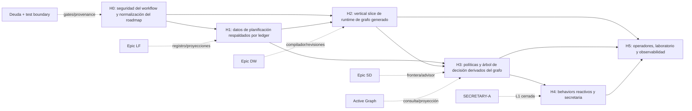

# Evolutivo: integración de roadmap para workflows generados

> **Estado:** borrador de evaluación; no es la autoridad canónica del roadmap,
> del backlog, del ledger ni de los ciclos.
>
> **Artefacto de investigación de origen:**
> `~/.local/share/sddk/projects/p-63676b11dc0ef88f/cycle-artifacts/p-63676b11dc0ef88f/kernel-cycle-58-workflow-hardening/research/evolutivo-generated-workflow-roadmap-integration.md`
> (SHA-256 `c79b1a2697bd3ac870a66dce22797b5907bfcc5c0310172017225b7b92c62b1d`).
>
> **Propósito:** permitir revisión humana antes de promover decisiones a ADR,
> spec, backlog y proyecciones canónicas.

## Intención ejecutiva

La topología objetivo es única: todo workflow será finalmente un grafo de
ejecución generado para la problemática, con pasos variables. Cada transición
legal se registra de forma durable; las políticas se consultan y derivan del
grafo; el orquestador calcula un árbol de decisión determinista y auditable.

La secretaria solo puede asistir con autoridad cerrada, no destructiva y
orientada a propuestas. Las plantillas estáticas pueden sobrevivir durante la
migración como entrada del compilador o proyección renderizada, pero nunca como
una segunda autoridad de topología.

### No objetivos

- No rediseñar el álgebra de workflows durante el hardening actual.
- No convertir a la secretaria en scheduler, mutador directo o sustituto de la
  política del motor.
- No convertir el árbol de decisión en una segunda autoridad frente al ledger.
- No resolver lifecycle/backlog editando manualmente `ROADMAP.md` o
  `BACKLOG.md`; el objetivo es una proyección derivada del ledger.

## Estado actual: verdad operativa

| Capacidad | Estado | Consecuencia de integración |
|---|---|---|
| `WorkflowTemplate` → `WorkflowIR` → `ExecutionGraphRevision` | Sustrato enviado | Preservar el modelo de tres niveles; no crear topología estática paralela. Véase `crates/sddk-domain/src/workflow_ir.rs` y `graph.rs`. |
| Ejecución de operadores | Parcial | Solo `Task`, `Sequence`, `Parallel`, `Choice` y `Map` se ejecutan; `Join`, `Race`, `Loop`, `Gate`, `Wait`, `SubWorkflow` y `Compensate` siguen sin semántica de runtime. H2 debe declarar explícitamente su alcance. |
| Eventos runtime | Parcial | Hay eventos canónicos, pero la consolidación de buses y cadena única de lineage permanece como deuda. |
| Compilación dinámica y expansión | Propuesto / parcial | El compilador determinista y el IR existen; falta el ciclo runtime de `ExpansionProposal`, revisión aprobada y replay probado. Véanse ADR-037 y SPEC-037. |
| Frontera y consulta de grafo | Sustrato enviado | `frontier_for_state`, `GraphView` y `PatternQuery` soportan H3; deben ser el lector único de topología. |
| Replan | No implementado | `cycle_replan` es un stub. Debe planificarse como corrección acotada de revisión de grafo, no como mutación de path. |
| Behaviors y secretaria | Bloqueado | SPEC-042 Stage 1 requiere `SPEC-028-promoted`; el trait de behavior y los recibos de cinco campos aún no son sustrato runtime. |
| Backlog/roadmap como ledger | Pendiente | Primitive 2 de Epic LF debe volver como H1: registro de planificación, procedencia y proyecciones deterministas. |
| Cycle-58 workflow hardening | Activo | Pertenece solo a H0: corrige seguridad, drift y contratos; no demuestra que H1–H5 estén iniciados. |

Las fuentes de planificación son
`docs/sddk-decision-kernel-architecture/02-roadmap/{ROADMAP,BACKLOG}.md`; las
fuentes de arquitectura son ADR-024, ADR-037, ADR-041, SPEC-037, SPEC-039 y
SPEC-042 bajo `docs/sddk-decision-kernel-architecture/`.

## DAG de horizontes de capacidad

No se debe planificar usando números de ciclo reutilizados. Los ciclos 52–54
tienen colisiones históricas entre recover-forward y Epic SD; los horizontes
son la unidad de orden, y los ciclos futuros obtendrán IDs canónicos y aliases
históricos cuando sea necesario.

### H0 — Seguridad y normalización

**Entrada:** el hardening actual (cycle-58).  
**Salida:** selección de path explícita; proyecciones A-min/runtime reconciliadas;
migración de esquema validada para pause/phase; autoridad de supersede forzada
en motor; hashes de artefacto revalidados; y recibos anti-fabricación.

Integra el hardening actual, DEBT y TEST-BOUNDARY sin duplicarlos.

### H1 — Datos de planificación respaldados por ledger

**Entrada:** H0 cierra taxonomía de estado y registro canónico.  
**Salida:** eventos de idea, triage, promoción, descarte y binding a ciclo;
procedencia inmutable; renderer determinista; cada entrada renderizada contiene
un ID trazable.

Refina Epic LF Primitive 2, no lo duplica. Es el cimiento de agenda y contexto
para el orquestador y la secretaria.

### H2 — Vertical slice de grafo generado

**Entrada:** contratos H0 y registro H1.  
**Salida:** un workflow se compila desde template y snapshot de capacidades a
IR; se valida; registra una revisión/expansión tipada; conserva marcador de
revisión y reconstruye exactamente el mismo grafo al hacer replay. Replan será
una corrección de grafo con contador y evidencia, no un cambio de path.

Static YAML solo será entrada/proyección transitoria. La generación estará
capability-gated hasta que los operadores restantes tengan semántica ejecutable.

### H3 — Política y árbol de decisión

**Entrada:** H2 ofrece un grafo generado replayable e IDs de transición legales.  
**Salida:** política tipada, versionada y consultable sobre inputs acotados del
grafo; cada evaluación deja evento durable. El orquestador deriva un árbol
determinista cuyas aristas corresponden solo a `transition_id` registrados.

Las decisiones destructivas requieren política y recibo de autoridad humana;
las ordinarias se derivan on-demand. El LLM puede proponer, nunca inventar una
arista ni autorizarla.

### H4 — Behaviors y secretaria

**Entrada:** H3 probado y `SPEC-028-promoted`.  
**Salida:** API de behavior con suscripciones tipadas, idempotencia versionada,
guardas de presupuesto/no-progreso, recibos de cinco campos y registro L1
cerrado. La secretaria solo propone, crea señales permitidas o escala: no
emite `lease.*`, `gate.*`, `receipt.*`, `release.*` ni supersedes.

### H5 — Operadores, laboratorio y observabilidad

**Entrada:** H2–H4 ejercen una topología generada real.  
**Salida:** semántica y tests deterministas para operadores restantes;
consolidación de buses/event lineage; laboratorio que compara ejecuciones;
Active Graph y observabilidad exponen revisiones, políticas y decisiones.

## Protocolo de reconciliación

1. **Registro canónico de ciclos:** ID inmutable, slug humano, horizonte,
   estado, referencias a eventos/recibos y aliases históricos opcionales.
2. **Taxonomía:** `proposed`, `planned`, `active`, `blocked`, `paused`,
   `superseded`, `released`, `archived`, `cancelled`. `partial` y
   `contradicted` son anotaciones de evidencia, no estados de lifecycle.
3. **Aliases, no renumeración silenciosa:** un número duplicado conserva alias
   histórico, pero el nuevo plan usa un ID canónico único.
4. **Promoción de investigación:** un claim requiere fuente, estado, owner,
   horizonte, evidencia de aceptación y gate predecessor antes de convertirse
   en ADR, spec o backlog.
5. **Prevención de drift:** cualquier documento estático se compara en
   verificación contra el grafo generado de la misma versión. Runtime frontier
   y policy graph son los únicos lectores de topología.
6. **Precedencia runtime:** ante contradicción, se marca el documento como tal;
   la evidencia del runtime no se sobrescribe con narrativa.

## Riesgos y decisiones humanas pendientes

| Decisión | Default seguro |
|---|---|
| DSL de política (Cedar, Rego o híbrido) | Mantener datos declarativos tipados; no introducir DSL runtime hasta ADR. |
| Persistencia del árbol de decisión | Derivar decisiones ordinarias; persistir recibo humano solo para transiciones destructivas. |
| Migración static → generated | Mantener static como input/proyección hasta que H2 pruebe replay y alcance explícito de operadores. |
| Migraciones SQLite | Fail-closed y fixtures contra esquema previo; no auto-reparación implícita. |
| Autoridad de secretaria | Default-deny y escalación; ninguna mutación destructiva. |

## Próxima promoción formal recomendada

Cuando el ciclo activo llegue a la fase que autorice decisiones de planificación:

1. Crear un ADR de normalización de roadmap: horizontes, IDs canónicos, aliases,
   taxonomía y prohibición de números duplicados.
2. Crear la spec H1 para datos de planificación del ledger y su renderer.
3. Crear la propuesta/spec H2 para compilación, expansión/revisión tipada,
   marcador de replay y replan acotado.
4. Crear el ADR H3 de políticas y árbol de decisión después de resolver el DSL y
   la persistencia de decisiones destructivas.
5. Actualizar ROADMAP/BACKLOG únicamente mediante el registro/proyección
   resultante, no mediante una agenda manual paralela.

## Índice de evidencia

- Investigación completa: artefactos de cycle-58 indicados en la cabecera.
- Roadmap y backlog: `docs/sddk-decision-kernel-architecture/02-roadmap/`.
- Arquitectura: ADR-024, ADR-037, ADR-041; SPEC-037, SPEC-039 y SPEC-042.
- Código: `crates/sddk-domain/src/workflow_ir.rs`,
  `crates/sddk-domain/src/graph.rs`, `crates/sddk-engine/src/operator.rs`,
  `crates/sddk-engine/src/cycle_replan.rs` y
  `crates/sddk-engine/src/workflow_runtime.rs`.
