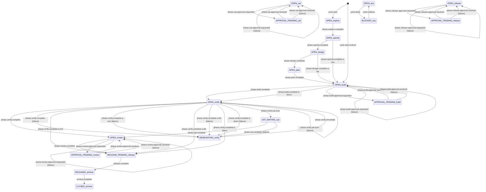

# Generated Workflow Reference

> Generated by `sddk generate docs` from `workflow/workflow.yaml`. Do not edit manually.

## Workflow Metadata

| Field | Value |
| --- | --- |
| ID | `sddk-standard` |
| Version | `0.1.0` |
| Schema version | `1` |
| Description | Deterministic SDDK workflow with mandatory debt verification in A-* paths |

## Statuses

| Order | Status |
| ---: | --- |
| 1 | `OPEN` |
| 2 | `BLOCKED` |
| 3 | `REMEDIATING` |
| 4 | `RELEASE_PENDING` |
| 5 | `RELEASED` |
| 6 | `CLOSED` |
| 7 | `ABANDONED` |
| 8 | `RECOVERING` |
| 9 | `UAT_WAITING` |
| 10 | `APPROVAL_PENDING` |

## Phases

| Order | Phase |
| ---: | --- |
| 1 | `explore` |
| 2 | `specify` |
| 3 | `design` |
| 4 | `plan` |
| 5 | `build` |
| 6 | `verify` |
| 7 | `uat` |
| 8 | `review` |
| 9 | `release` |
| 10 | `archive` |

## Paths

| Path | Debt verification | Phase sequence | Description |
| --- | --- | --- | --- |
| `A-full` | `mandatory` | `explore` → `specify` → `design` → `plan` → `build` → `verify` → `review` → `release` | Full path A - complete workflow with all phases |
| `A-lite` | `mandatory` | `explore` → `specify` → `design` → `build` → `verify` → `release` | Lite path - standard with minimal design |
| `A-min` | `mandatory` | `explore` → `specify` → `build` → `verify` → `release` | Minimal path - fastest route through workflow |
| `B-direct` | `disabled` | `build` → `verify` → `release` | Direct path B - disabled by default |

## Transitions

| ID | Paths | From | To | Requirements | Produces | On failure |
| --- | --- | --- | --- | --- | --- | --- |
| `cycle.start` | `A-min` `A-lite` `A-full` | _creation_ | `OPEN/explore` | `project.adopted` `project.initialized` `worktree.clean` `cycle.no_active_conflict` | `cycle-manifest` | — |
| `cycle.start.b-direct` | `B-direct` | _creation_ | `OPEN/build` | `project.adopted` `project.initialized` `worktree.clean` `cycle.no_active_conflict` | `cycle-manifest` | — |
| `phase.explore.complete` | `A-min` `A-lite` `A-full` | `OPEN/explore` | `OPEN/specify` | `artifact:exploration-report` `gate:exploration-sufficient` | `exploration-report` | — |
| `phase.specify.complete` | `A-lite` `A-full` | `OPEN/specify` | `OPEN/design` | `artifact:specification` `gate:requirements-testable` | `specification` | — |
| `phase.specify.complete.a-min` | `A-min` | `OPEN/specify` | `OPEN/build` | `artifact:specification` `gate:requirements-testable` | `specification` | — |
| `phase.design.complete` | `A-full` | `OPEN/design` | `OPEN/plan` | `artifact:design` `gate:architecture-consistent` | `design` | — |
| `phase.design.complete.a-lite` | `A-lite` | `OPEN/design` | `OPEN/build` | `artifact:design` `gate:architecture-consistent` | `design` | — |
| `phase.plan.complete` | `A-full` | `OPEN/plan` | `OPEN/build` | `artifact:implementation-plan` `gate:plan-executable` | `implementation-plan` | — |
| `phase.build.complete` | `A-min` `A-lite` `A-full` | `OPEN/build` | `OPEN/verify` | `artifact:implementation-receipt` `gate:implementation-complete` | `implementation-receipt` | — |
| `phase.build.complete.b-direct` | `B-direct` | `OPEN/build` | `OPEN/verify` | `artifact:implementation-receipt` `gate:implementation-complete` | `implementation-receipt` | — |
| `phase.verify.complete` | `A-full` | `OPEN/verify` | `OPEN/review` | `artifact:verification-report` `gate:tests-pass` `gate:policy-compliant` `gate:debt-severity-assigned` `gate:debt-priority-assigned` | `verification-report` | `REMEDIATING/verify` |
| `phase.verify.complete.a-min` | `A-min` | `OPEN/verify` | `RELEASE_PENDING/release` | `artifact:verification-report` `gate:tests-pass` `gate:policy-compliant` `gate:debt-severity-assigned` `gate:debt-priority-assigned` | `verification-report` | `REMEDIATING/verify` |
| `phase.verify.complete.a-lite` | `A-lite` | `OPEN/verify` | `RELEASE_PENDING/release` | `artifact:verification-report` `gate:tests-pass` `gate:policy-compliant` `gate:debt-severity-assigned` `gate:debt-priority-assigned` | `verification-report` | `REMEDIATING/verify` |
| `phase.verify.complete.b-direct` | `B-direct` | `OPEN/verify` | `RELEASE_PENDING/release` | `artifact:verification-report` `gate:tests-pass` `gate:policy-compliant` | `verification-report` | `REMEDIATING/verify` |
| `phase.verify.remediate` | `A-min` `A-lite` `A-full` `B-direct` | `REMEDIATING/verify` | `OPEN/verify` | `gate:remediation-complete` | — | — |
| `phase.verify.uat.sync` | `A-full` | `OPEN/verify` | `UAT_WAITING/uat` | `gate:uat-activated` | `uat-plan` | `OPEN/verify` |
| `phase.uat.complete` | `A-full` | `UAT_WAITING/uat` | `OPEN/review` | `artifact:uat-report` `gate:uat-verdict` | `uat-report` | `REMEDIATING/verify` |
| `phase.review.complete` | `A-full` | `OPEN/review` | `RELEASE_PENDING/release` | `artifact:review-report` `gate:review-approved` | `review-report` | — |
| `release.complete` | — | `RELEASE_PENDING/release` | `RELEASED/archive` | `artifact:merge-receipt` `artifact:release-receipt` `gate:no-pending-effects` `gate:release-uat-approved` | `merge-receipt` `release-receipt` | — |
| `archive.complete` | — | `RELEASED/archive` | `CLOSED/archive` | `artifact:archive-manifest` `gate:ledger-valid` `gate:vault-index-current` | `archive-manifest` | — |
| `phase.build.approval.requested` | `A-min` `A-lite` `A-full` | `OPEN/build` | `APPROVAL_PENDING/build` | `gate:approval-requested` | `approval-receipt` | `OPEN/build` |
| `phase.build.approval.resolved` | `A-min` `A-lite` `A-full` | `APPROVAL_PENDING/build` | `OPEN/build` | `gate:approval-resolved` | `approval-receipt` | `OPEN/build` |
| `phase.uat.approval.requested` | `A-full` | `OPEN/uat` | `APPROVAL_PENDING/uat` | `gate:approval-requested` | `approval-receipt` | `OPEN/uat` |
| `phase.uat.approval.resolved` | `A-full` | `APPROVAL_PENDING/uat` | `OPEN/uat` | `gate:approval-resolved` | `approval-receipt` | `OPEN/uat` |
| `phase.review.approval.requested` | `A-full` | `OPEN/review` | `APPROVAL_PENDING/review` | `gate:approval-requested` | `approval-receipt` | `OPEN/review` |
| `phase.review.approval.resolved` | `A-full` | `APPROVAL_PENDING/review` | `OPEN/review` | `gate:approval-resolved` | `approval-receipt` | `OPEN/review` |
| `phase.release.approval.requested` | `A-full` | `OPEN/release` | `APPROVAL_PENDING/release` | `gate:approval-requested` | `approval-receipt` | `OPEN/release` |
| `phase.release.approval.resolved` | `A-full` | `APPROVAL_PENDING/release` | `OPEN/release` | `gate:approval-resolved` | `approval-receipt` | `OPEN/release` |
| `cycle.block` | — | `OPEN/*` | `BLOCKED/*` | `gate:block-condition-met` | — | — |
| `cycle.unblock` | — | `BLOCKED/*` | `OPEN/*` | `gate:unblock-condition-met` | — | — |

## Artifacts

| Artifact | Producer | Consumers | Required | Terminal | Description |
| --- | --- | --- | --- | --- | --- |
| `approval-receipt` | `human` | `engine` | yes | no | Receipt confirming a human approval decision for a governed capability |
| `archive-manifest` | `archiver` | — | yes | yes | Final archive manifest |
| `cycle-manifest` | `runtime` | `engine` | yes | no | Initial canonical cycle state |
| `design` | `designer` | `planner` `verifier` | yes | no | Technical design document |
| `exploration-report` | `agent` | `reviewer` | yes | no | Report documenting exploration findings |
| `implementation-plan` | `planner` | `builder` | yes | no | Implementation plan with tasks |
| `implementation-receipt` | `builder` | `verifier` | yes | no | Receipt confirming implementation completion |
| `merge-receipt` | `local-git` | — | yes | yes | Receipt confirming the local HEAD SHA was pushed and verified on origin/main; no PR or CI/CD authority is required |
| `release-receipt` | `local-git` | — | yes | yes | Receipt confirming an annotated tag for the verified main SHA exists on the remote; external distribution is optional post-tag work |
| `review-report` | `reviewer` | `release-manager` | yes | no | Review approval report |
| `specification` | `agent` | `designer` | yes | no | Requirements specification document |
| `uat-plan` | `agent` | `uat-runner` `human` | no | no | UAT acceptance plan (YAML canonical, ADR-012) |
| `uat-report` | `agent` | `human` `release` | no | no | UAT aggregated report with verdict (ADR-012) |
| `verification-report` | `verifier` | `reviewer` | yes | no | Report documenting verification results |

## Gates

| Gate | Type | Description |
| --- | --- | --- |
| `approval-requested` | `binary` | Human approval was requested for a governed capability |
| `approval-resolved` | `binary` | Human approved or denied a governed capability request |
| `architecture-consistent` | `binary` | Architecture is internally consistent |
| `block-condition-met` | `binary` | Block condition is satisfied |
| `debt-priority-assigned` | `binary` | Every open finding in debt-report.json has priority ∈ {P0, P1, P2, P3} |
| `debt-severity-assigned` | `binary` | Every open finding in debt-report.json has severity ∈ {critical, high, medium, low} |
| `exploration-sufficient` | `binary` | Exploration produced sufficient information |
| `implementation-complete` | `binary` | Implementation meets requirements |
| `ledger-valid` | `binary` | Ledger state is valid |
| `no-pending-effects` | `binary` | No pending required local Git effects; CI/CD, GitHub Actions, forge releases, and distribution are optional post-tag consumers and are excluded |
| `plan-executable` | `binary` | Implementation plan is executable |
| `policy-compliant` | `binary` | Implementation complies with policies |
| `release-uat-approved` | `binary` | Release UAT gate passed for the configured release type (ADR-012) |
| `remediation-complete` | `binary` | Remediation addressed failures |
| `requirements-testable` | `binary` | Requirements are testable |
| `review-approved` | `binary` | Review approved the work |
| `tests-pass` | `binary` | All tests pass |
| `uat-activated` | `binary` | Orchestrator decided to run UAT (activation function, ADR-012) |
| `uat-verdict` | `binary` | UAT report has a human verdict (release gate per config, ADR-012) |
| `unblock-condition-met` | `binary` | Unblock condition is satisfied |
| `vault-index-current` | `binary` | Vault index is current |

## State Diagram

