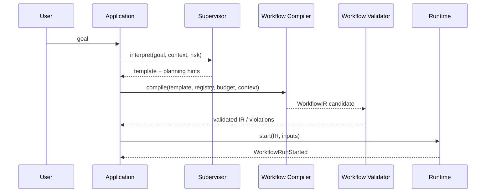
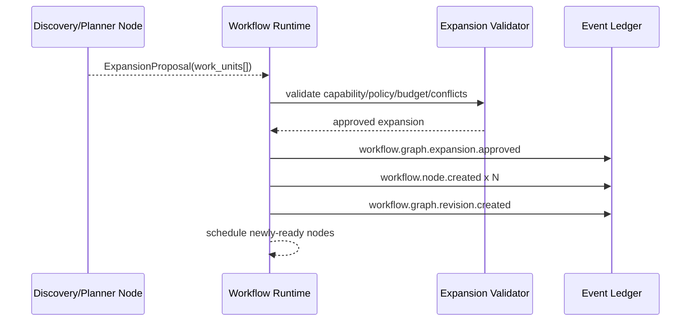
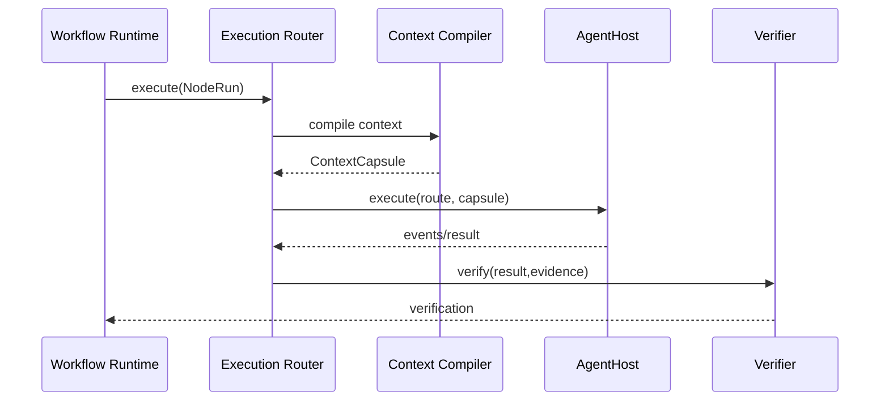
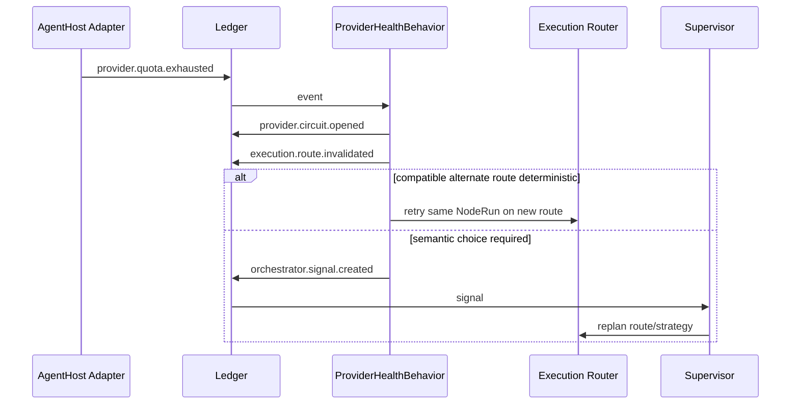
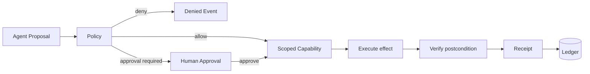

# Control Flows

## 1. Goal → Template → Workflow IR



## 2. Dynamic graph expansion



The LLM never mutates scheduler structures directly.

## 3. Map/Fan-out → Join

```text
DiscoverAffectedAreas
  → WorkUnits[auth, db, api, cli]
  → Map(implementation.worker, concurrency=adaptive)
  → Join(all | quorum | first-valid)
  → Integrate
```

## 4. Node execution



## 5. SDD Adaptive convergence

```text
SHAPE
  ↓
ChangeContract
  ↓
BUILD
  ↓
CONVERGE
  ├─ PASS → INTEGRATE
  ├─ GAPS → create WorkUnits → BUILD
  └─ AMBIGUOUS/HIGH-RISK → Supervisor/Human → revised contract or work
```

## 6. Reactive provider failure



## 7. Cognitive signal injection
Never concatenate raw log text. Compile:

```text
Canonical Event + projection state + workflow/node + progress
+ allowed actions + route candidates + relevant ChangeContract fragment
→ OrchestratorSignal → ContextCapsule delta → AgentHostControl
```

## 8. Governed effect


