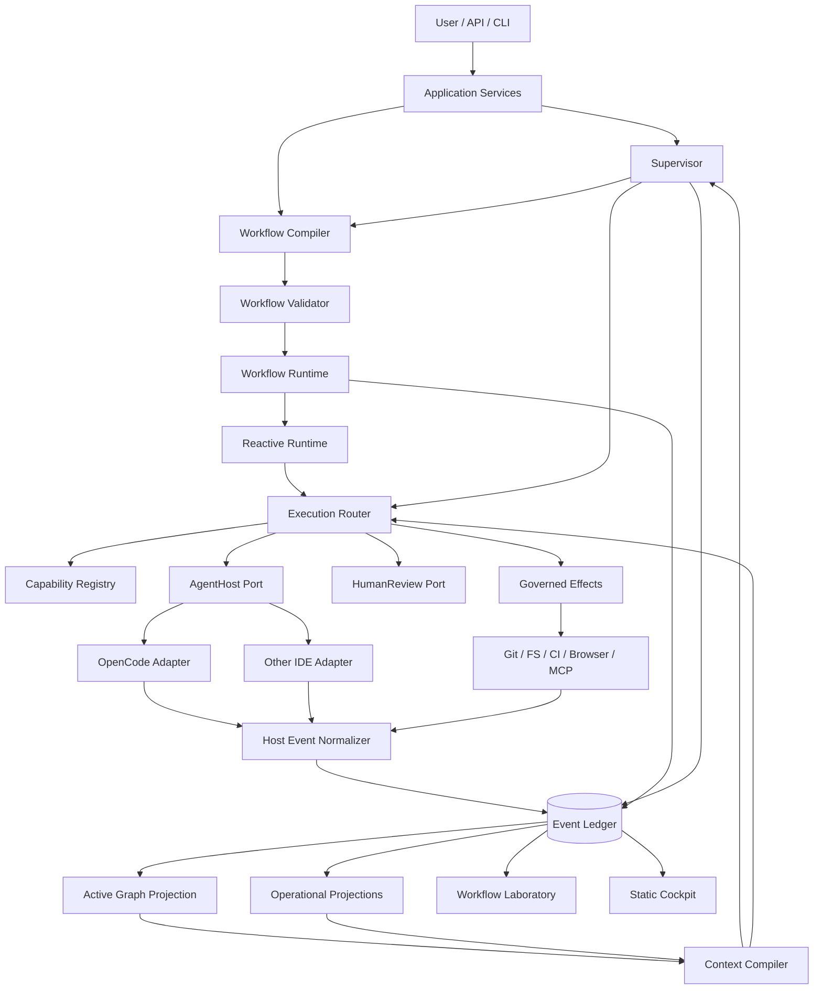

# DESIGN — SDDK Software Development Decision Kernel

## 1. Objective
Transform SDDK into a generic, local-first control kernel for human + agent software engineering where **engineering guarantees stay stable while workflow execution can adapt dynamically**.

## 2. Key architectural refinement

```text
Workflow Template (stable intent/invariants)
        ↓
Supervisor / Planner
        ↓
Workflow Compiler
        ↓
Workflow Validator
        ↓
Workflow IR (provider-neutral)
        ↓
Durable Workflow Runtime
        ↓
Execution Graph revisions (dynamic)
```

This deliberately borrows the useful principle from recent programmatic/dynamic agent workflows — moving orchestration out of conversational state and into executable runtime state — without executing arbitrary model-generated scripts as kernel authority.

## 3. Logical architecture



## 4. Layer responsibilities

### `sddk-kernel`
Stable semantics:
- IDs/value objects;
- event/envelope contracts;
- WorkflowTemplate/WorkflowIR contracts;
- graph expansion commands;
- capability/policy/evidence/receipt schemas;
- ContextCapsule and error taxonomy;
- ChangeContract core schema.

No SQLite/OpenCode/Git/HTTP/model dependency.

### `sddk-app`
Use cases:
- select/compile/validate workflow;
- start/resume/cancel workflow;
- ingest event;
- approve/reject dynamic expansion;
- route execution;
- compile context;
- query causal explanation;
- build Cockpit/Laboratory snapshots.

### `sddk-orchestration`
- Workflow Compiler;
- Workflow Validator;
- workflow runtime/scheduler;
- graph revision manager;
- map/fan-out/join/choice/loop/wait/subworkflow/compensation;
- Supervisor service;
- reaction policies/behaviors;
- router/failover/budgets.

### `sddk-context`, `sddk-ledger`, `sddk-graph`, adapters and packs
Keep the boundaries from the previous architecture pack. Packs own domain semantics; the kernel owns generic control semantics.

## 5. Workflow algebra
Kernel-level operators:

```text
Task | Sequence | Parallel | Map | Join | Race | Choice
| Loop | Gate | Wait | SubWorkflow | Compensate
```

Agentic patterns such as Orchestrator/Workers, Generator/Evaluator and Convergence are compositions over these primitives, not new scheduler implementations.

## 6. Dynamic graph expansion
A running node may return a typed `ExpansionProposal`, never mutate runtime state directly.

```text
ExpansionProposal
  → capability/policy/budget/conflict validation
  → workflow.graph.expansion.approved
  → node/edge events
  → graph revision
  → scheduling
```

This makes dynamic composition durable, replayable, testable and provider-independent.

## 7. Supervisor / Runtime separation
Supervisor:
- interpret goal/risk/uncertainty;
- select template;
- propose WorkflowIR or semantic amendments;
- replan ambiguous failures;
- decide when specialists/critic/human input is justified.

Runtime:
- validate;
- schedule;
- maintain graph state;
- execute operators;
- enforce concurrency/leases/retries/timeouts/budgets/policies;
- persist every transition.

## 8. SDD Adaptive
SDD becomes invariant-driven rather than phase-driven.

```text
PREFLIGHT (deterministic)
   ↓
SHAPE → ChangeContract
   ↓
BUILD → dynamic WorkUnits/worktrees
   ↓
CONVERGE ⇄ BUILD
   ↓ PASS
INTEGRATE
```

Mandatory guarantees:
- intent and scope defined;
- acceptance criteria testable;
- architecture/security constraints represented when relevant;
- implementation linked to requirements/work units;
- independent verification/evidence;
- governed effects and release evidence.

`explore`, `proposal`, `spec`, `design`, `tasks`, `debt-verify` remain capabilities/views that are deployed adaptively rather than mandatory AgentRuns.

## 9. Reliability and security
- event + execution idempotency;
- graph revision optimistic concurrency;
- retry policies and circuit breakers;
- side-effect receipts;
- bounded expansion depth/node count/concurrency/cost;
- no arbitrary LLM-generated code execution as orchestration authority;
- human gates for policy-defined risk;
- kill/restart/resume from ledger.

## 10. Evaluation
A-full remains the reference workflow while `sdd-adaptive` is experimental. Workflow Laboratory compares quality, invariant coverage, regressions, agent calls, handoffs, context, cost, time and convergence rounds before promotion.
