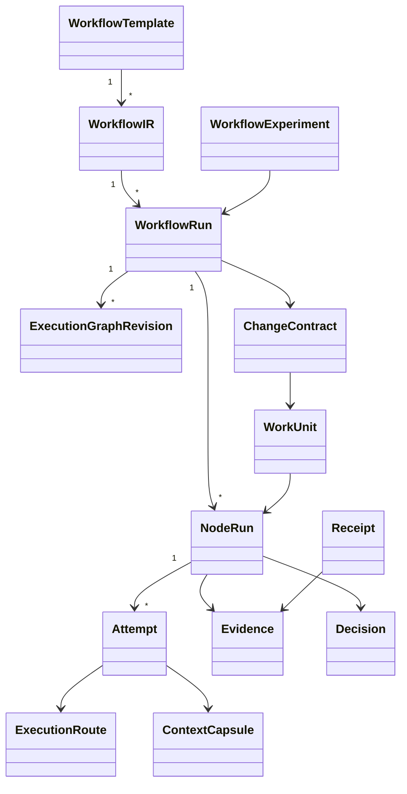

# Domain Model

## Core entities

### WorkflowTemplate
Stable pack-owned declaration of goal class, invariants, policies, allowed capabilities, budgets and high-level stages. It intentionally avoids over-specifying every runtime node.

### WorkflowIR
Validated provider-neutral executable representation produced by the Workflow Compiler. Contains control operators, capability calls, schemas, guards and expansion permissions.

### WorkflowRun
Durable execution instance bound to a template/IR version, inputs, correlation id, budgets and current execution graph revision.

### ExecutionGraphRevision
Versioned snapshot/delta of the logical runtime graph. New nodes/edges may be added only via validated expansion commands.

### NodeRun
Logical unit of work. Stable across retries/provider switches.

### Attempt
Physical attempt to execute a NodeRun on a concrete route.

### WorkUnit
Dynamically discovered/buildable unit within an adaptive workflow. A WorkUnit may become a NodeRun, a mapped set of NodeRuns or a subworkflow.

### ChangeContract
Semantic contract for a software change. Source of truth for SDD intent rather than the existence of individual Markdown phases.

Typical sections:
- intent/problem/outcome;
- in/out scope;
- requirements + acceptance criteria;
- constraints/invariants;
- design decisions/ADRs;
- risks;
- verification obligations;
- evidence links;
- WorkGraph.

`spec.md`, `design.md`, `tasks.md` are optional projections/views of this contract.

### AgentExecution
Execution of a logical agent; may occur within an Attempt.

### Capability
Semantic action available to planner/router/runtime.

### ExecutionRoute
Concrete host + logical agent profile + provider + model + credentials/policy route.

### ContextCapsule
Compiled context contract for one execution/attempt.

### Evidence
Artifact supporting a claim, requirement, verification or acceptance.

### Decision
Explicit conclusion with rationale, confidence and evidence refs.

### Receipt
Verifiable record of a governed side effect and its postcondition.

### ProviderHealth
Derived state: healthy/degraded/open/unknown.

### Budget
Hierarchical limits per workspace/workflow/node/attempt.

### HumanDecision
Approval/rejection/waiver/acceptance/signoff.

### WorkflowExperiment
Comparison unit for baseline/adaptive/forked workflows with common goal/evaluation contract.

## Pack-owned domain extensions

Packs may add domain entities without placing their semantics in the generic
kernel. The SDD pack defines the logical `DebtReport`, `DebtIncidence`,
`DebtPlan` and `DebtPriorityPolicy` entities (ADR-040/SPEC-041); version suffixes
such as `DebtReportV2` belong to their wire schemas. Their lifecycle is
represented by canonical events; Active Graph and Markdown nodes are rebuildable
projections.

## Relationships

## Identity rule
A dynamic expansion does not replace the workflow. It creates a new `ExecutionGraphRevision` and emits causally linked events. Retrying a node creates an `Attempt`; it does not create a new logical WorkUnit.

## Legacy migration
- `CyclePath` becomes a legacy compiler hint/preset.
- `Phase` becomes pack metadata/label, not a kernel enum.
- `CycleManifest` can be projected into `WorkflowRun + ChangeContract + legacy metadata` during migration.
