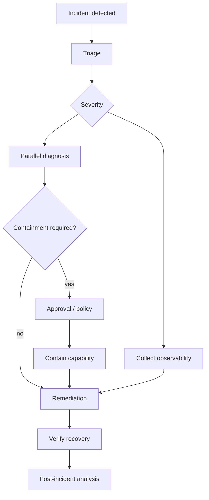

# `sddk-incident` Workflow

## Why this pack matters
Incident response is intentionally unlike SDD: it is event-driven, urgency-sensitive, often parallel, includes waits and governed side effects. It tests the generality of Workflow v2.

## Flow

## Reactive events
- monitoring alert can start workflow;
- deployment event can enrich context;
- provider outage can reroute diagnostic agent;
- human severity override changes priority/budget.

## Governed effects
Containment, rollback and production changes require capability scopes and receipts.
