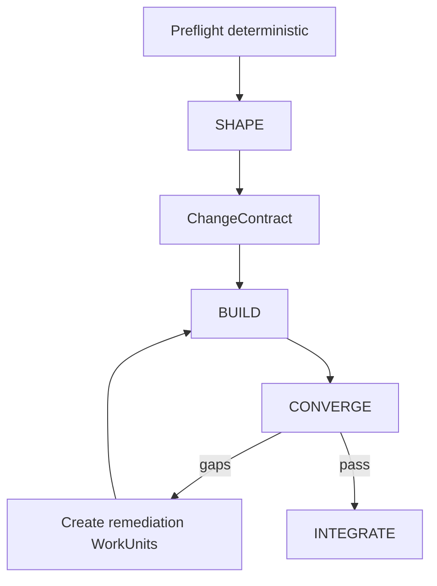

# `sdd-adaptive` Workflow

## Purpose
A compact SDD strategy that dynamically spends planning/review effort where risk and uncertainty require it.



## SHAPE pattern
Default: one shaping capability. Expand when necessary:

```text
Shaper
 ├─ optional Repo Explorer
 ├─ optional Research
 ├─ optional Architect
 ├─ optional Security
 └─ optional Test/UAT planner
        ↓
    ChangeContract
```

Trigger specialists from risk/uncertainty/context signals, not fixed path names.

## BUILD pattern
- WorkGraph derived from ChangeContract.
- `Map` independent WorkUnits across isolated worktrees.
- Sequential dependencies remain sequential.
- newly discovered work emits ExpansionProposal.

## CONVERGE pattern
1. deterministic tests/lint/type/build/architecture fitness;
2. compute evidence gaps and change-risk signals;
3. activate only required verification capabilities;
4. produce `ConvergenceVerdict`;
5. if gaps, append remediation WorkUnits and repeat.

## INTEGRATE pattern
Governed deterministic operations: merge/postconditions, provenance/SBOM, release receipt, knowledge projections, journal/metrics. Generate human summaries as projections if desired.

## Example — tiny change

```text
Shape(1) → Build(1) → deterministic verify → Integrate
```

## Example — authentication rewrite

```text
Shape
 ├ Explorer
 ├ Architect
 └ Security
Build
 ├ Backend worktree
 └ Frontend worktree
Converge
 ├ tests
 ├ architecture
 ├ security adversary
 └ UAT
  ↺ remediation if gaps
Integrate
```

## Compatibility artifacts
The pack can materialize `proposal.md`, `spec.md`, `design.md`, `tasks.md`, `verify-report.md` from ChangeContract/ledger projections without forcing an agent boundary for each file.
