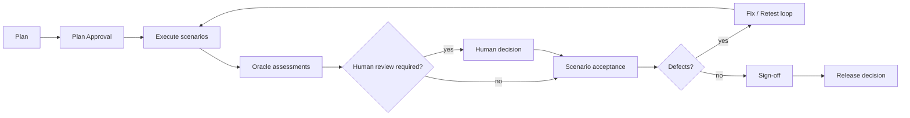

# `sddk-uat` Workflow

## High-level flow

## Key semantics
`PASSED` is not automatically `ACCEPTED`. Machine assessment and human decision remain separate.

## Event examples
- `uat.plan.created`
- `uat.plan.approved`
- `uat.scenario.started`
- `uat.evidence.recorded`
- `uat.oracle.assessed`
- `uat.human.review.requested`
- `uat.defect.opened`
- `uat.retest.completed`
- `uat.signoff.recorded`

## Change-driven retest
A change can emit `evidence.stale` and schedule only affected scenarios when policy allows.
