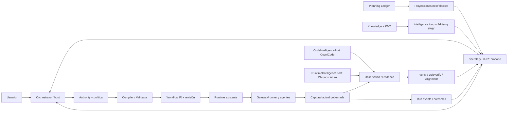

# Arquitectura emergente y mapa de responsabilidades

## Regla de evolución

Preservar hexágonos y una única autoridad por hecho. Crecer mediante casos de uso **estrechos** conectados a consumidores reales, no mediante un «control plane de oficina» paralelo. Extraer lógica fuera del CLI únicamente cuando tenga un segundo consumidor real o viole una responsabilidad. Un `trait` de inyección local no implica nuevo crate, API de red ni almacenamiento.

## Owners, puertos y flujos prohibidos

| Owner | Canoniza | No hace |
|---|---|---|
| Planning | WorkItems, edges, decisión asociada; proyecciones candidatas | Autorizar effects, escoger scheduler genérico, convertir finding a WorkItem sin criterio |
| Execution | Workflow IR/revisiones/run/node/attempt/eventos | Crear verdad sobre claims por salida textual |
| Knowledge/Observation | assertions, observaciones, basis, procedencia, contradicción | Ejecutar probes, decidir gobernanza |
| Verification | claim + evidencia+scope → resultado | Afirmar cobertura de test no vinculada, inferir PASS por ausencia |
| Governance | política/capability/side effects | Heredar permisos del nombre de una skill |
| Secretary | reglas, propuestas, síntesis/advisory | `release.*`, `gate.*`, `lease.*`, `receipt.*` fuera de su closed-set; efecto directo |
| Orchestrator | seleccionar propuestas, decidir delegación dentro de autoridad delegada | Saltarse gates/consentimiento humano exigible |
| Gateway | invocar capabilities/CLI con env/timeout/argv/redacción, receipts | Ser propietario de Knowledge/Verification o proveer segundo ledger |
| Proveedores CogniCode/Chronos | observaciones dentro de capacidades negociadas | Aprobar una claim o escribir autoridad en SDDK |
| ContextCapsule | selección efímera de refs relevantes para un target | Copiar transcript completo o convertirse en Memory |

## Estructuras sin nuevos agregados

- **Agenda**: consulta pura y explicable que combina `project_next`/`project_blocked` (solo spine), event/run/verify status y refs válidas. No scheduler paralelo; `candidate_by_planning` ≠ `admitted_to_execute`. Snapshot no reconciliado, múltiples Active y dependencia ausente → resultado explícito, no «READY».
- **Árbol de decisiones**: vista navegable `WorkItem ↔ DecisionRecord ↔ evidence/observation ↔ PlanRevision`; las alternativas y experimentos de Decision Memory/Decision Lab se consultan por referencia. No un nuevo almacén de hipergrafo.
- **Behaviour Tree**: patrón o vista declarativa compilada a operadores realmente ejecutables. Guarded `Choice` ≠ fallback en fallo. Semántica de `Retry` depende de idempotencia del efecto. Las políticas reactivas proponen expansiones; solo runtime autorizado muta grafo.
- **Handoff**: `AgentContributionEnvelope` + salida real de attempt + ContextCapsule, refs y síntesis existente. Resolver el contrato documental `ExecutionRequest/ExecutionOutcome` contra tipos efectivos antes de añadir clases nuevas.

## Concurrencia y coherencia

1. Resolver project/workspace, source revision/dirty state, policy/config, scope y epoch de ledger antes de lanzar capturas que deban correlacionarse; conservar basis individual si no hay snapshot atómico entre repositorio y SQL.
2. Fan-out de **lecturas independientes** con límites. Ningún ejecutor pesado por simple evento genérico. Guardas de coste, caducidad, versionado y cancelación; composición parcial explícita.
3. Productores entregan observaciones y referencias, no escriben read-models. Persistir por writer canónico y CAS con controles de concurrencia existentes. Actualizar/reconstruir vistas bajo demanda o por invalidación conocida; medir antes de crear un motor incremental.
4. Usar `intelligence_loop::compose_intelligence_loop` y `derive_advisory_context` como compositores de resultados **ya evaluados**, nunca como responsables de correr analizadores ni de decidir permisos.

## Casos de adopción paso a paso

A6 primero: `CodeIntelligencePort` real, una relación estática demostrable y su claim Verify. A continuación capturador de un test/gate real, contexto duradero y una expansión mínima. Los mismos contratos deben funcionar sin proveedor enhanced: Base mantiene su UAT actual, y REQUIRED ausente produce un gap/fallo explícito para esa operación.
