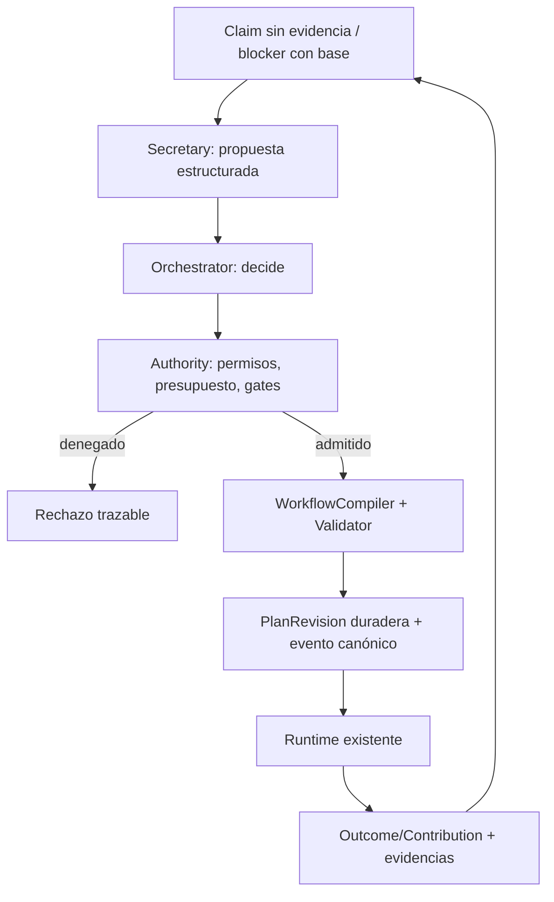

# Orchestrator, Secretary, handoff y workflows adaptativos

## El símil de oficina, traducido a responsabilidades existentes

- **Jefe / Orchestrator:** ve objetivos, presupuesto, decisiones y resultados; acepta/rechaza/reformula propuestas y delega dentro de la autoridad conferida. El kernel valida efectos; humano decide cuando la política exige aprobación.
- **Secretario:** consulta proyecciones, observaciones, Verification, runtime y decisiones; prepara *asuntos y alternativas* mediante L0 reglas, L1 acciones del closed-set y L2 recomendaciones acotadas. No posee cola canónica nueva ni concede permisos.
- **Especialista / agente:** recibe contexto derivado y tareas con criterios de aceptación; elige herramientas cuando hace falta; produce contribuciones, artefactos y trabajo.
- **Oficina / kernel:** writer canónico, control de autoridad, provenance, estados, compilación, eventos, recover, receipts.

## Agenda mínima — sin modelo nuevo

Una consulta read-only compone (a) `project_next`/`project_blocked` para el spine **reconciliado**, (b) estado del run/ciclo, (c) claims con gap y decisiones previas, (d) disponibilidad real de capacidades. Expone separado `planning_candidate`, `requires_decision`, `requires_evidence`, `in_progress`, `blocked`. Una tarea «preparable» solo si existen inputs mínimos, permiso de lectura y presupuesto; **NO** afirmar ejecutable por tener dependencias terminales. `project_next` selecciona por spine y falla con múltiples Active, NO sustituye scheduler.

Fase inicial sin nueva proyección persistida: consulta pura + JSON/texto desde el mismo resultado. Si el consumidor pide latencia/reanudación de vista y se demuestra coste, evaluar read-model checkpoint existente. No generar WorkItem por alerta: propuesta al Orchestrator, admisión y dedup explícitas.

## Protocolo de handoff reutilizado

Usar `AgentContributionEnvelope`/validator + runtime `Attempt`/outcomes y receipts, síntesis con disposition/dissent, `ContextCapsule` engine y `cold_start` como construcción *de continuidad*. `arch-spec-007` define `ExecutionRequest/Outcome` conceptuales: verificar su mapeo con tipos productivos actuales, no crear `WorkHandoff` por analogía. Antes de delegar: construir cápsula bounded con objetivo, scope, constraints, accepted/rejected decisions, evidence refs y artefactos; preservar hipótesis como hipótesis. Un run interrumpido debe reconstruirse desde store real tras cerrar proceso, no usar `InMemoryCapsuleStore` como prueba de durabilidad. Fallo/stale/missing reference ⇒ handoff incompleto y petición de evidencia, nunca success sintético.

## Workflow estático, híbrido y dinámico

- **Estático:** plantilla SDD actual traducida al mismo IR; seguir aplicando gates previstos.
- **Híbrido:** plantilla SDD + una expansión específica autorizada cuando un productor identifica una necesidad verificable.
- **Dinámico:** un objetivo abierto forma primero un plan acotado usando Task/Sequence/Parallel/Choice/Map si su semántica en la ruta real cubre el caso; las observaciones posteriores motivan nuevas revisiones. No generar todos los nodos por anticipado, pero tampoco introducir código ejecutable arbitrario producido por LLM.

**Semántica obligatoria de expansión:** evento que la dispara y basis hash; identidad/dedup de propuesta; precondiciones/revisión padre; permisos de expansión ya declarados; validación DAG/recursos/trabajos simultáneos; límite de nodos, profundidad, tiempo y coste; node/attempt completados inmutables; `propose` nunca hace `commit`; parent revision y nuevo digest; replay/reinicio no repiten efectos. No introducir `Loop`, `Race`, `Wait`, `Join`, `Gate`, `SubWorkflow`, `Compensate` si `build_operator` sigue rechazándolos. La diferencia `Choice` guard vs Selector fallback-en-error requiere UAT propio si se necesita.

## Ejemplo de pensamiento lateral sin nueva entidad

Una observación de cambio de path asociado a un contrato + `VerifyResult` sin evidencia produce *un asunto de atención*, no un WorkItem automático. Secretary propone un único `Task` verificador ya registrado como capacidad. Orchestrator acepta; runtime genera revisión aditiva; tras la prueba, Verification actualiza claim y Secretary retira el asunto de la vista. Toda la trayectoria se reconstruye con refs Planning→PlanRevision→NodeRun→Attempt→Evidence→Decision. Un segundo evento idéntico no duplica la rama.
