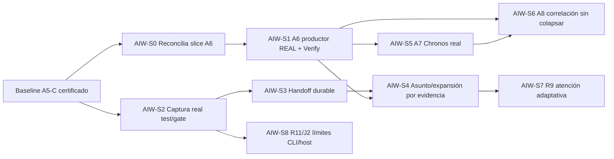

# Plan de hitos de adopción — integrado en A6/A7/A8/J2/R9/R11

**Este archivo es un delta/plan de aceptación, NO un roadmap canónico alternativo.** Reconciliar cada slice con `docs/architecture/a5/A5-CURRENT-ROADMAP.md` y sus WorkItems existentes antes de abrirlo. Los IDs `AIW-S*` son locales al documento, **no** IDs reales del Planning Ledger. Nunca reabrir A5-C, SEC-1, ni CC-S0 por una descripción histórica desactualizada. El A6 productivo debe demostrar observación real+Verify, no solo puerto/fake.

## Diagrama de dependencias (no orden total)

### AIW-S0 — Preflight de un único slice (sin gran E0)

**Encaje:** sincronización A6 / ADR-0137 y `arch-spec-021`; trabajo documental de admisión, no implementar más modelos. **Entrada:** HEAD real, roadmap, CC-S0 receipt, provider/CLI disponibles, WorkItem y claim consumidores. **Tareas:** verificar qué relación observable ofrece CogniCode REAL, seleccionar un contrato arquitectónico de SDDK, reconciliar CC-S0 implementado vs A6 enhanced pendiente, confirmar basis/digest canónico y compatibilidad, cerrar owners/writer/normalizer/Verify. **Salida:** un scope contract y caso UAT que puedan fallar (no aceptar fake). **Gate:** dato real, consumidor real, presupuesto y target de persistencia identificados, sin violar Roadmap authority. **Fallo:** si no hay proveedor real, A6 permanece bloqueado por capacidad, NO declarar enhanced ni abrir un gran proyecto de agenda.

### AIW-S1 — A6: observación estática que cambia una claim

**No reabrir CC-S0.** Adaptador CogniCode ejecutable; negotiate, cancel/reconnect, un análisis real elegido por capacidad; normalizador `code_intelligence_port` result→`observation::SoftwareObservation` con revision/scope/config/analyzer/provider/complete y digest realmente SHA-256; Verify consume ObservationSet no vacío y produce resultado justificado. No importación de AST pesado ni entrada de SDK al dominio. **Dos pasadas** sobre revisiones con cambio controlado y en entorno sin proveedor; `Unknown/Partial/Unavailable/Incompatible` permanecen diferenciables. **Gate:** UAT-A01..A09, Base green. La persistencia completa de contradicciones requiere AIW-S1b solo si un UAT real demuestra que relaciones existentes no bastan.

### AIW-S1b — Forma sucesora de evidencia observacional, CONDICIONAL

**Encaje:** deuda exacta A6/A8, NO etapa obligatoria. Probar primero writer actual. Si no permite guardar dos observaciones contradictorias con identity+basis+relation sin pérdida, aprobar AIW-ADR-03 mediante número canónico y migración aditiva; dual-read compatibility, no segundo store, writer canónico. **Gate:** UAT-A10..A13. Si no se demuestra carencia, cancelar slice.

### AIW-S2 — Captura gobernada de UNA familia de tests/gates

**Encaje:** habilitador de consumo Verification/agent experience en el carril vigente, no una certificación A5 retrospectiva. Un runner real existente+resultado de una claim conocida, exposición del Gateway a invocación agent/host sin nuevo runner, receipt que conserva status, timeout, complete, attempt, source basis, output refs, redaction. El wrapper CLI es opcional y se nombra tras verificar CommandRegistry. Primer formato estructurado concreto (p. ej. nextest con versión fijada), sin prometer seis parsers. **Gate:** UAT-T01..T10, sin canaries en salidas persistidas y con un consumidor Verify real. Si `RunOutcome` no contiene información por testcase, **no** inferirla: consumir reporte nativo o dejar `Unknown`.

### AIW-S3 — Handoff duradero entre DOS tareas estáticas

**Encaje:** línea agente/host existente y J2 cuando corresponda; no prerrequisito obligatorio para A6. Implementar adaptador mínimo a `CapsuleInputs`/ContextCompiler del engine desde store real y envelope/outcome/receipts efectivos; mapear `arch-spec-007` documental a código. Cerrar proceso, reabrir storage y construir siguiente intento manteniendo WorkItem/PlanRevision/Attempt/evidence y dissent. **Gate:** UAT-H01..H09. Sin transcript, sin `InMemoryStore` como única persistencia.

### AIW-S4 — Primera expansión dinámica por evidencia

**Encaje:** workflow evolution actual; no implementar BT entero. Trigger: observación de A6 + claim con gap → Secretary propone tarea verificador registrado → Orchestrator decide → Authority valida → compiler+validator aceptan nueva PlanRevision → runtime ejecuta sin repetir nodos anteriores. **Gate:** UAT-W01..W11; operator caracterizado en la ruta real, límite de concurrencia y fallo cerrado ante unsupported. Si el trigger no existe, mantener workflow estático.

### AIW-S5 — A7: evidencia Chronos de escenario REAL

**Encaje:** A7 Runtime Enhanced, posterior/independiente del detalle estático. Proveedor ejecutable, capability negocia, escenario controlado y repetible o variación declarada, contexto env/instrumentation/sampling/completeness, una claim con consumidor, timeout/cancel/error conservados. **Gate:** UAT-P05..P08 y no regressión Base. No afirmar «comportamiento confirmado» por una única traza incompleta.

### AIW-S6 — A8: observaciones estáticas/runtime juntas

**Encaje:** A8 bloqueado por A6+A7. Usar `intelligence_loop`/advisory y relaciones de observación para presentar corroboración/contradicción con dos bases distintas sin convertirla en aprobación. Usar forma sucesora observacional solo si S1b acreditada. **Gate:** UAT-P09..P12; no summary score universal, no pérdida de contradicciones.

### AIW-S7 — R9/UX del Secretary (si el consumidor lo requiere)

**Encaje:** atención/watchlists, no agenda store. Consulta sobre Planning snapshot reconciliado, Verify gaps, outcomes y refs; probar múltiple Active/missing dep/as-of e identidad. Primero reconstrucción pura, checkpoint solo con coste medido. Comprobar wiring productivo Secretary L0/1/2 sin abrir authority. **Gate:** UAT-G01..G09 y coste real de consulta.

### AIW-S8 — J2/R11: fronteras CLI/host, decisión de packaging basada en evidencia

**Encaje:** J2..J6 paralelos, R11 P3. Probar reutilización `arch-spec-030` con JCode y, cuando corresponda, segundo host; runner+record unificado; experimento segundo binario read-only sobre caso de uso extraído con segundo consumidor real. **Gate:** UAT-X01..X08; no autorizar split si se duplican storage/Authority/schema ni si daemon pasa a ser obligatorio.

## Riesgos de secuenciación y no-gates

- S2 puede avanzar en paralelo con S1 si usa contratos de gateway/storage separados y un consumidor real; jamás saltar cambios SEC-1. S1b es condicional; NO bloquear evidencia estática simple esperando persistencia avanzada de contradicciones.
- S4 requiere S1+S3 demostrados para el caso integrado; los microtest de compiler pueden elaborarse antes sin declarar «workflow adaptativo operativo».
- Jev/TypeSafe no es dependencia ni hito del roadmap. Solo spike aislado descrito en [METRICS-AND-SPIKES.md](../METRICS-AND-SPIKES.md).
- Cada slice necesita presupuesto, owner, WorkItem real (reconciliado), UAT fresco, receipt y declaración de las rutas que **no** cubre. `cargo test` de tests de módulo ≠ UAT productivo.
