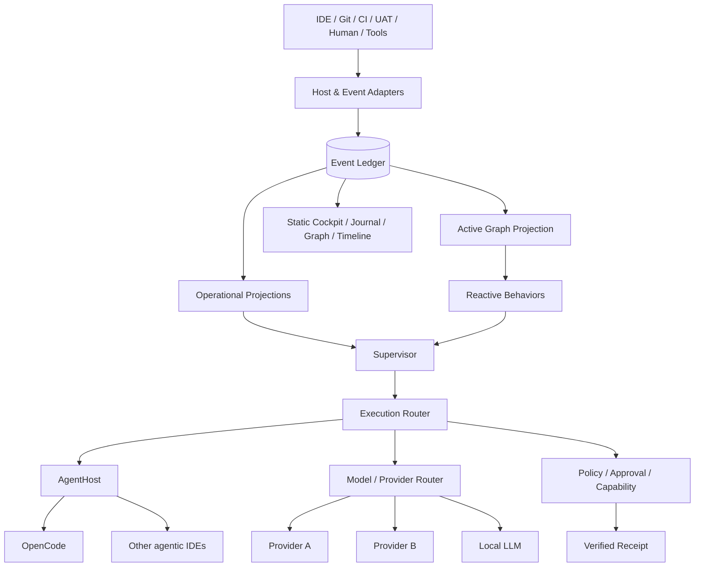

# SDDK — Software Development Decision Kernel

> **Event-sourced reactive software-engineering control plane for human + agent workflows.**

Este paquete consolida la evolución de SDDK desde **Specification-Driven Development Kernel** hacia **Software Development Decision Kernel** sin cambiar las siglas ni perder compatibilidad conceptual con el proyecto actual.

La nueva interpretación pone el foco donde realmente está evolucionando el producto: **decisiones, ejecución gobernada, workflows, agentes, evidencia, UAT, trazabilidad, contexto, failover, control de proveedores y aprendizaje operacional**. SDD deja de ser el significado del producto y pasa a ser **un workflow pack de primera clase** sobre un kernel genérico.


## Numeración y encaje con SDDK 2.0 existente

Este paquete asume que el repositorio ya ha llegado hasta **ADR-019**. Por eso las nuevas decisiones comienzan en **ADR-020**. Las nuevas especificaciones arrancan en **SPEC-019**, conservando la intención de la propuesta previa (`Supervisor`, `Capability Registry`, `Context Capsule`, `Agent Execution`, `Workflow Runtime`, `Evaluation`) y continúan desde ahí. **SPEC-030 extiende, no sustituye, el UAT bounded context ya definido previamente en el repositorio.** Al integrar, reconcilia cualquier numeración que haya avanzado en `main`.

## Idea central



## Qué resuelve

- Un workflow no queda bloqueado si un proveedor o modelo falla, agota cuota o deja de estar disponible.
- El **agente lógico** deja de estar acoplado a un modelo concreto.
- El supervisor recibe **señales estructuradas**, no ruido bruto ni logs convertidos indiscriminadamente en prompts.
- Los fallos triviales se resuelven con **behaviors deterministas**; sólo los problemas que requieren juicio despiertan al LLM supervisor.
- Los workflows son genéricos y componibles; SDD, UAT, incidentes, seguridad o releases son packs.
- El Event Ledger es la fuente de verdad; el grafo, el journal y el cockpit son proyecciones reconstruibles.
- El Control Plane puede visualizarse sin servidor: `SQLite -> projection -> cockpit.html` autocontenido.
- Cada acción con efecto queda gobernada, verificada y registrada mediante receipts.
- Las métricas históricas alimentan decisiones futuras de routing, coste, modelo y estrategia.

## Cómo estudiar este paquete

1. `00-vision/PRODUCT-VISION.md` — qué es el nuevo SDDK.
2. `00-vision/PRINCIPLES.md` — reglas que deben mantenerse aunque cambie la implementación.
3. `01-architecture/DESIGN.md` — arquitectura objetivo completa.
4. `02-roadmap/ROADMAP.md` — secuencia de implementación recomendada.
5. `03-adrs/` — decisiones arquitectónicas y sus consecuencias.
6. `04-specs/` — contratos ejecutables de los principales subsistemas.
7. `05-workflows/` — catálogo y ejemplos de workflows sobre el runtime genérico.
8. `06-control-plane/` — Cockpit, Journal y vistas moldables.
9. `08-spikes/` — pruebas de viabilidad antes de comprometer implementación.
10. `09-implementation/` — backlog, fitness functions y Definition of Done.

## Mapa de documentos

| Área | Documento principal |
|---|---|
| Nombre y posicionamiento | `00-vision/NAMING.md` |
| Diseño global | `01-architecture/DESIGN.md` |
| Límites hexagonales | `01-architecture/HEXAGONAL-BOUNDARIES.md` |
| Modelo de dominio | `01-architecture/DOMAIN-MODEL.md` |
| Event Ledger + Active Graph | `01-architecture/EVENT-AND-GRAPH-MODEL.md` |
| Roadmap | `02-roadmap/ROADMAP.md` |
| Migración | `02-roadmap/MIGRATION-PLAN.md` |
| Supervisor | `04-specs/SPEC-019-SUPERVISOR-RUNTIME.md` |
| Workflow runtime | `04-specs/SPEC-023-WORKFLOW-RUNTIME-V2.md` |
| Routing/failover | `04-specs/SPEC-025-EXECUTION-ROUTER.md`, `SPEC-026-PROVIDER-HEALTH-FAILOVER.md` |
| IDE abstraction | `04-specs/SPEC-022-AGENT-HOST-PROTOCOL.md` |
| Context Capsules | `04-specs/SPEC-021-CONTEXT-CAPSULE-PROTOCOL.md` |
| Reactive behaviors | `04-specs/SPEC-028-REACTIVE-BEHAVIORS.md` |
| Cockpit | `04-specs/SPEC-029-CONTROL-PLANE-COCKPIT.md` |
| UAT | `04-specs/SPEC-030-UAT-PACK.md` |
| Gobernanza | `04-specs/SPEC-031-GOVERNED-CAPABILITIES.md` |
| Evaluación | `04-specs/SPEC-024-AGENT-EVALUATION.md` |
| Deuda técnica durable | `03-adrs/ADR-040-DURABLE-DEBT-REMEDIATION.md`, `04-specs/SPEC-041-DURABLE-DEBT-REMEDIATION.md` |
| Test-tooling ownership | `docs/adr/ADR-0069-test-tooling-ownership.md` (accepted) |
| Test-tooling sequencing | `03-adrs/ADR-042-TEST-TOOLING-BOUNDARY.md` (Accepted) |
| Test-tooling evidence | `09-implementation/TEST-TOOLING-EVIDENCE-AUDIT.md` |

## Resultado arquitectónico deseado

```text
sddk-kernel        <- contratos y semántica estable
sddk-app           <- casos de uso y servicios de aplicación
sddk-orchestration <- workflow runtime, supervisor y behaviors
sddk-context       <- context compiler/capsules/staleness
sddk-ledger        <- event store + projections
sddk-graph         <- proyección de conocimiento operacional
adapters/*         <- sqlite, fs, git, mcp, opencode, http, computer-use...
packs/*            <- sdd, uat, incident, security, release...
hosts/*            <- cli, server opcional, integrations
```

No es obligatorio convertir cada bloque en crate desde el primer día. **Primero fronteras semánticas y tests; después crates cuando reduzcan acoplamiento real.**

## 2026-08-19 refinement — Dynamic Workflows & SDD Adaptive

This update adds a provider-neutral interpretation of recent dynamic/programmatic workflow ideas:

```text
WorkflowTemplate → WorkflowCompiler → WorkflowIR → Validator
→ durable Runtime → evented dynamic ExecutionGraph revisions
```

It also introduces experimental `sdd-adaptive`:

```text
SHAPE → BUILD ⇄ CONVERGE → INTEGRATE
```

The existing A-full SDD path is intentionally retained as the reference/baseline until Workflow Laboratory proves that adaptive execution preserves quality while reducing unnecessary handoffs/tokens/time.

Start with ADR-037, ADR-038, ADR-039 and SPEC-037..040.
