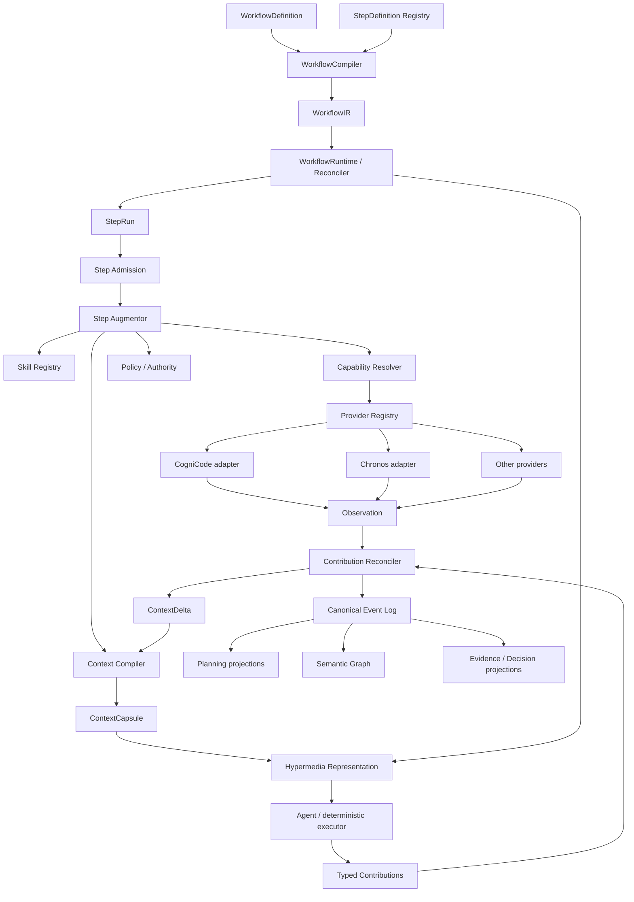

# Arquitectura objetivo

## Vista general



## Ciclo operativo

```text
Desired workflow
   ↓ compile/validate
WorkflowIR
   ↓ reconcile
StepRun
   ↓ admit + augment
ExecutableStep
   ↓ expose
Hypermedia state + legal affordances
   ↓ execute
Contributions + Observations
   ↓ validate/reconcile/persist
Canonical facts + projections + ContextDelta
   ↓
next reconcile
```

## Una sola autoridad por concepto

| Concepto | Autoridad |
|---|---|
| Workflow authored intent | `WorkflowDefinition` versionado |
| Executable topology | `WorkflowIR` content-addressed |
| Runtime progress | `WorkflowRun` / `StepRun` derived from canonical events |
| Legal transitions/actions | policy + state + authority → derived affordances |
| Work planning | WorkItem/dependency planning substrate |
| Evidence | universal EvidenceRef/EvidenceBundle + CAS |
| Decisions | DecisionRecord / decision memory |
| Semantic relationships | canonical semantic graph projection |
| Provider result | Observation with provider provenance |
| Agent input | ContextCapsule/ContextBasis |
| Incremental context | ContextDelta |
| Agent output | typed Contribution envelope |
| Host transcript | host, never SDDK |

## Resource model

Resource IDs son URIs lógicas, independientes del transporte:

```text
sddk://projects/{project}
sddk://workspaces/{workspace}
sddk://workflows/{workflow}@{version}
sddk://runs/{run}
sddk://runs/{run}/steps/{step-run}
sddk://contexts/{context}
sddk://work-items/{work-item}
sddk://decisions/{decision}
sddk://evidence/{evidence}
sddk://observations/{observation}
sddk://artifacts/{artifact}
```

No implican un servidor HTTP. Son identifiers canónicos para CLI/MCP/HTTP/receipts.

## Affordance

Una `Affordance` es una operación derivada legal en el estado actual:

```rust
struct Affordance {
    rel: Relation,
    action: ActionId,
    target: ResourceRef,
    input_schema: SchemaRef,
    output_schema: SchemaRef,
    required_authority: AuthorityRequirement,
    evidence_requirements: Vec<EvidenceRequirement>,
    idempotency: IdempotencyContract,
    cost_hint: Option<CostHint>,
    expires_with_basis: ContextBasisRef,
}
```

**No se persiste como hecho canónico por defecto.** Se recalcula para evitar affordances stale. Sí puede aparecer en execution receipts para reproducibilidad.

## Step model

Un StepDefinition describe semántica estable y reusable:

```text
StepDefinition
├── task_kind
├── input contracts
├── output contracts
├── context requirements
├── capability requirements/preferences
├── evidence contract
├── authority class
├── retry/convergence defaults
├── augmentation profiles
└── compatible execution modes
```

Una instancia concreta es `StepRun`, ligada a WorkflowRun, revisions, attempts y output lineage.

## Augmentation pipeline


Orden importa:

1. Validar contratos/versiones.
2. Resolver ContextBasis y context keys.
3. Seleccionar skills por task kind/context.
4. Derivar capabilities agregadas.
5. Negociar providers disponibles.
6. Aplicar authority/policy/budgets.
7. Generar la representación ejecutable y las affordances.

Ninguna skill concede permisos; sólo declara necesidades/instrucciones.

## Provider model

```text
Capability          Provider implementation
-----------         -----------------------
code.structure   →  CogniCode
code.usages      →  CogniCode
code.boundaries  →  CogniCode
runtime.trace    →  Chronos
runtime.summary  →  Chronos
source.search    →  future research provider
content.citation →  future authoring provider
```

Provider selection queda fuera del dominio. El domain sólo conoce capabilities y `Observation` normalizada.

## Progressive disclosure

Un ContextCapsule no vuelca la base completa. Incluye:

- current goal/frontier;
- active WorkItems;
- decisiones vinculantes/relevantes;
- invariants;
- blockers/negative knowledge;
- evidence/observation summaries;
- expandable resource refs;
- staleness/provenance.

El agente expande bajo demanda mediante affordance `context.expand`.

## Control-flow fuera de prompts

Destino:

```text
WorkflowDefinition = control-flow
StepDefinition     = contrato operativo
Skill              = expertise
Capability         = poder abstracto
Provider           = implementación
Prompt             = instrucciones cognitivas del step
```

La eliminación de lógica procedural de prompts es un criterio de migración, no un prerequisito inmediato.
