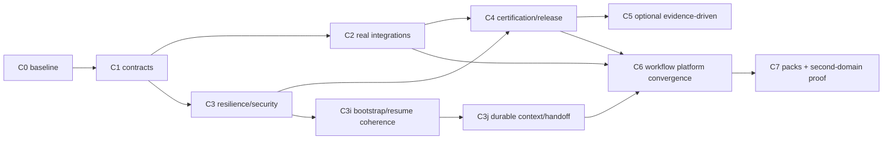

# Roadmap overlay — continuidad sobre ROADMAP vigente

## Autoridad

Este archivo es un **delta propuesto**, no un roadmap canónico alternativo. Al integrarlo:

- conservar C0–C5 existentes y receipts históricos;
- no reetiquetar C2a/C2b como fallidos;
- no declarar C3 histórico “no cerrado” retroactivamente;
- añadir los follow-ups nuevos como trabajo descubierto posteriormente;
- no bloquear una certificación BASE actual por C6/C7.

## Encaje recomendado



C5 y C6 son siblings post-C4. C6 **no espera** X08/J7/J8/J9/R11 salvo que un slice concreto lo requiera.

---

# Delta inmediato: C3 follow-ups

## C3i — Bootstrap/adoption/cycle recovery coherence

**Prioridad:** P0/P1 product reliability.  
**Naturaleza:** follow-up descubierto tras C3a-h; no invalida receipts históricos.

### Problema falsable

El runtime CLI puede inferir un único ciclo activo, mientras `sddk-cycle-resume` mantiene una regla antigua que bloquea sin cycle ID confiable. Adoption también aparece demasiado como ritual explícito en bootstrap pese a que el engine soporta convergencia idempotente.

### Objetivos

1. Unificar bootstrap sobre el resolver real de `cycle.rs`.
2. Repeated bootstrap/adoption en proyecto convergido = no-op semántico.
3. 0/1/N ciclos producen estados tipados y recoveries correctas.
4. El agente no vuelve a pedir adopción en cada sesión.
5. El bootstrap entrega una única identidad project/workspace/cycle coherente.

### Superficie probable

- `skills/sddk-cycle-resume/SKILL.md`
- application service nuevo/reutilización en `sddk-cli`
- adoption/status/ensure orchestration
- tests de `cycle.rs`
- workflow contract tests

### Exit gate

- 20 restarts/invocations same project: no repeated adoption request.
- único active cycle inferido sin explicit ID.
- multiple active cycles => typed ambiguity, never guess.
- no remote => same persisted identity.
- legacy callers siguen funcionando.

### UAT

`CTX-UAT-001..005`, `MIG-UAT-001`.

---

## C3j — Durable context/session continuity + hypermedia bootstrap MVP

**Prioridad:** P1 para agent experience.  
**Dependencia:** C3i.

### Objetivos

1. Persistent CapsuleStore detrás de seam actual.
2. Persistent SessionBindingStore.
3. `context bootstrap` application service.
4. Progressive refs + `context expand` mínimo.
5. ContextDelta durable/monotonic across process restart.
6. Primera representación hipermedia de Project/Run/Step state, sin control-flow cutover aún.

### Non-goals

- no WorkflowDefinition custom todavía;
- no migración completa de prompts;
- no third-party augmentors;
- no segundo host requerido.

### Exit gate

Dos procesos secuenciales reconstruyen el mismo basis/capsule desde storage; el segundo recibe sólo delta si hay cambio; session != run se preserva; transcript no se importa.

### UAT

`CTX-UAT-006..015`, `HYP-UAT-001..004`, migration/crash cases.

---

# C4 — Sin cambio semántico

C4 conserva el contrato vigente de certificación/release. C3i/C3j sólo bloquean el perfil/afirmación agentic que dependa de estas features; **no deben convertirse por inercia en gates BASE si BASE no las declara**.

Si C3i/C3j modifican paths compartidos por BASE, se ejecuta el impacto/gates aplicables normalmente.

---

# C5 — Mantener opcionales existentes

X08/J7/J8/J9/R11 permanecen según triggers actuales. Este paquete no los promociona.

---

# C6 — Workflow Platform Convergence

**Objetivo:** hacer que los componentes ya existentes formen una plataforma de workflows dinámicos/reutilizables agent-first con una sola ejecución authority.

## C6a — Contracts: Resource, Affordance, StepDefinition, WorkflowDefinition

### Entregables

- ADTs/schemas versionados mínimos.
- Resource URI rules.
- StepDefinition registry.
- WorkflowDefinition parser/validator.
- mapping de current SkillDefinition/task_kind/context keys.
- ningún side effect nuevo.

### Exit

Compiler puede rechazar definitions inválidas y resolver un workflow trivial a current WorkflowIR sin ejecutarlo.

### UAT

HYP-001..003, STEP-001..006, WF-001..006.

---

## C6b — Compiler convergence + equivalence shadow

### Entregables

- WorkflowDefinition → normalized template → WorkflowIR.
- legacy WorkflowManifest adapter/projection.
- equivalence tests sobre workflows software por defecto.
- completar sólo operators imprescindibles para el primer slice.

### Regla

Shadow compila/compara; **no dual-execution de side effects**.

### Exit

Un workflow default seleccionado produce IR equivalent respecto a ordering, gates, artifacts/contracts y failure behavior definidos para el slice.

---

## C6c — Step Augmentor + CapabilityResolver + ProviderRegistry

### Entregables

- admission pipeline;
- skill selection por task_kind/context;
- capability aggregation;
- provider resolution;
- CogniCode mappings;
- Chronos mappings;
- explain augmentation.

### Exit

Workflow author usa `software.architecture-design` sin mencionar CogniCode y obtiene capabilities estáticas cuando están disponibles; runtime-sensitive step obtiene Chronos sólo cuando policy/step lo requiere.

### UAT

AUG-UAT-001..014, OBS-UAT-001..008.

---

## C6d — ContributionReconciler + default software vertical

### Entregables

Migrar una vertical completa, recomendación:

```text
explore → design → tasks → apply → verify
```

no necesariamente todo A-full de una vez.

- agent outputs → typed Contributions;
- tasks → WorkItems/deps;
- decisions → DecisionRecords;
- provider results → Observations/Evidence;
- tests/gates → EvidenceRefs;
- render Markdown como projection/artifact;
- StepRun completion por contracts.

### Exit

Nueva sesión continúa el mismo cycle/run sin relectura completa y puede explicar lineage `StepRun → Contribution → Decision/Evidence/Observation`.

---

## C6e — Hypermedia execution surface + prompt slimming

### Entregables

- resource/actions porcelain;
- MCP generic resource/action tools;
- affordance derivation basis-bound;
- typed problem/recovery actions;
- eliminar lifecycle recipes duplicadas de los prompts del slice migrado.

### Exit

Un harness con conocimiento sólo del hypermedia protocol puede recorrer el vertical slice.

---

## C6f — User workflows, reusable steps and subworkflows

### Entregables

- user/project scoped WorkflowDefinition;
- version-resolved StepDefinition registry;
- reusable/subworkflow calls;
- project/user/framework precedence;
- custom workflow compilation/admission;
- no arbitrary trusted mutation webhook todavía.

### Exit

Usuario compone workflow nuevo con registered steps sin editar prompts SDDK y hereda context/evidence/provider augmentation automáticamente.

---

# C7 — Domain Generalization

## C7a — Software Pack boundary

Clasificar contracts actuales: core vs software pack. Mover sólo cuando dependency fitness/UAT demuestren boundary. No crate split obligatorio.

### Exit

Core tests no asumen git, source code, tests o release salvo fixtures de software pack.

## C7b — Authoring/Book Pack experimental

Implementar mínimo:

```text
book-brief
→ research
→ outline
→ map(write-section)
→ consistency-review
→ loop(revise)
→ publish
```

Providers de research/content pueden ser fakes/deterministic adapters al principio, pero al menos un recorrido UAT debe usar recursos reales/controlados adecuados al entorno.

### Objetivo real

Falsar software-specific leakage, no construir un editor comercial.

## C7c — Second-domain portability certification experimental

### Exit

- mismo WorkflowRuntime;
- mismo ContextCapsule/Delta;
- mismo hypermedia protocol;
- mismo evidence/decision substrate;
- same StepDefinition/augmentation model;
- cero forks de core;
- problemas domain-specific resueltos en pack.

Si no se cumple, no declarar core genérico; registrar qué abstracción falló.

---

# C8 — Futuro, no abrir todavía

Sólo tras C7:

- third-party augmentation controllers;
- remote registries;
- pack signing/trust distribution;
- stable external SDK;
- richer provider scheduling/federation;
- semantic memoization/caching si métricas lo justifican.

No crear WorkItems C8 antes de triggers observados.
