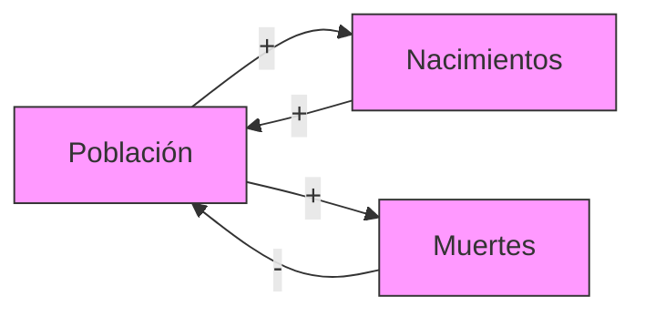

## Activation Contract

Úsalo en **Fase 2 del análisis sistémico**, después de R0 (definir el sistema) y antes de diagnosticar arquetipos/traps. Modela la estructura de feedback del tema.

No lo uses para: modelar stocks-and-flows cuantitativos (`deep-stocks-flows-diagrammer`), mapear arquetipos (`deep-system-archetypes-mapper`).

## Hard Rules (Meadows / Forrester)

- **Nodos = variables**: nada más (no agentes, no eventos — esos se modelan como variables con comportamiento).
- **Aristas con polaridad**: `+` (misma dirección) o `-` (inversa).
- **Loops B (balancing)**: número par de negativos; comportamiento de homeostasis.
- **Loops R (reinforcing)**: cero o número impar de negativos; comportamiento exponencial.
- **Delays marcados `||`**: entre causa y efecto.
- **Toda afirmación sobre un loop tiene fuente** (Forrester, Meadows, paper seminal del campo).
- **"All systems, everywhere, consist of these two kinds of concepts — stocks and flows — and none other."** (Forrester, 1971).

## Execution Steps

### Modo A: Construir el CLD del tema

1. Lee `research/system-map/{topic}.yml` (R0).
2. Identifica las **5-10 variables clave** (regla 80/20: pocas variables cargan la dinámica).
3. Para cada par, pregúntate: ¿qué afecta a qué?
4. Marca polaridad: si X sube 10%, ¿Y sube o baja?
5. Identifica loops cerrados. Nombra como B1, B2, R1, R2...
6. Marca delays con `||`.
7. Documenta el **loop dominante** (cuál explica más comportamiento).

### Modo B: Analizar un CLD existente

1. Lee el CLD.
2. Enumerar todos los ciclos simples (usar NetworkX `simple_cycles` si SOFTWARE).
3. Para cada ciclo:
   - Contar número de aristas negativas.
   - Si par → B; si impar → R.
   - Marcar delays presentes.
4. Calcular el **loop dominante** según el reference mode observado.

### Modo LIBRO: producir diagrama

- Genera `research/diagrams/{topic}-cld.mmd` (Mermaid).
- Genera `research/drafts/{topic}-cld-section.md` (borrador AsciiDoc con explicación).

### Modo SOFTWARE: producir blueprint de detector

- Input: lista de variables + aristas con polaridad.
- Output: lista de loops clasificados (B/R) con delays.
- Algoritmo: enumerar ciclos + contar polaridades.
- Test fixtures: CLDs canónicos de World3 (population loop, pollution loop, agriculture loop).

## Convenciones del diagrama

- **Nodos**: `id[label]` en Mermaid.
- **Aristas con polaridad**: `--> con +` o `--> con -` (en Mermaid, usar anotación textual).
- **Loops**: etiqueta con `B1`, `R1`, etc.
- **Delays**: marcar con `||` en la arista.

### Ejemplo Mermaid



(O usar `flowchart LR` con `-->|"+"|` y `-->|"-"|`).

## Esquema de CLD

```yaml
cld:
  topic: "World3 Population"
  variables:
    - {id: population, type: stock}
    - {id: births, type: flow}
    - {id: deaths, type: flow}
  edges:
    - {from: population, to: births, polarity: +, delay: false}
    - {from: births, to: population, polarity: +, delay: true}  # delay de ~15 años
    - {from: population, to: deaths, polarity: +, delay: false}
    - {from: deaths, to: population, polarity: -, delay: false}
  loops:
    - id: R1-population-growth
      type: reinforcing
      edges: [population→births, births→population]
      delays: 1
      dominant: true
    - id: B1-population-deaths
      type: balancing
      edges: [population→deaths, deaths→population]
      delays: 0
      dominant: false
  reference_mode: "exponential_growth_then_decline"
```

## Decision Gates

| Situación | Acción |
|-----------|--------|
| > 20 variables | STOP: simplificar. Regla 80/20: pocas cargan la dinámica. |
| Loop sin polaridad clara | Documentar la ambigüedad; hacer análisis de sensibilidad |
| Sin loops R | Inconsistente (todo sistema tiene crecimiento); revisar |
| Sin loops B | Inconsistente (todo sistema tiene homeostasis); revisar |
| Delay no marcado | Marcarlo: el delay es lo que causa oscilación |

## Output Contract

### LIBRO
- `research/diagrams/{topic}-cld.mmd`.
- `research/cld/{topic}.yml` (modelo formal).
- `research/drafts/{topic}-cld-section.md`.

### SOFTWARE
- `research/blueprints/cld-detector.yml` (API para clasificar loops en un grafo).
- `research/code-patterns/cld-detector.py` (NetworkX).
- `research/test-fixtures/world3-population.cld` (test fixture).

## References

- **Forrester, J. W.** (1961). *Industrial Dynamics*. MIT Press.
- **Forrester, J. W.** (1971). *World Dynamics*. Productivity Press.
- **Meadows, D. H.** (2008). *Thinking in Systems*. Cap. 2.
- **MIT OCW 15.988**: tutoriales.
- **Sterman, J.** (2000). *Business Dynamics*. Cap. 5-7.
- `references/cld-conventions.md` — convenciones detalladas.
