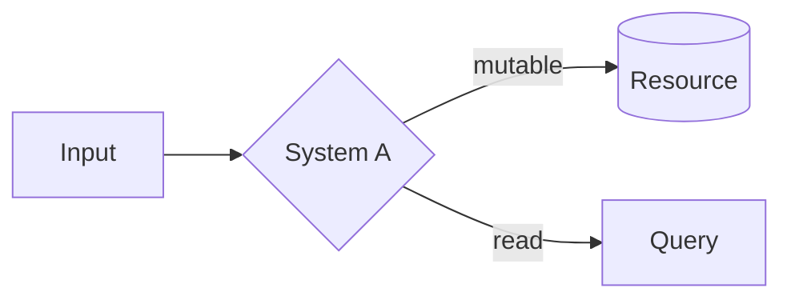
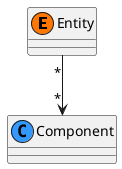
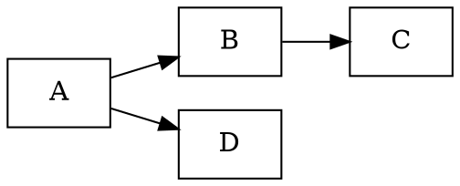

# Guía de notación de diagramas

## Mermaid — uso preferente para GitHub-rendered
Los `.mmd` se renderizan nativamente en GitHub dentro de bloques ` ```mermaid `. Úsalos para:



## PlantUML — UML formal
Para diagramas de clases con estereotipos, componentes y secuencias con mensajes numerados:



## C4 — arquitectura por niveles
C4-PlantUML para Contexto → Contenedor → Componente → Código. Útil para mostrar un sistema completo y luego profundizar.

## Graphviz/DOT — grafos densos
Cuando hay muchos nodos y Mermaid se vuelve ilegible:



## Regla de validación
Todo diagrama debe poder contrastarse con:
- Un ejemplo en `examples/` (para diagramas de código), o
- Una evidence card / spec (para diagramas conceptuales).

Si no hay contra qué validar, el diagrama es decorativo y debe eliminarse.
